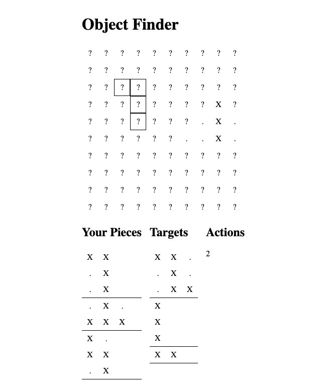

I'm doing some reflection posts on last year. I published one last month about [my favorite reads from 2022](/blog/2022-what-i-read). In this post I'm revisiting the projects I worked on.

## One Game a Month

I kicked off 2022 doing "One Game a Month" (1GAM). I thought 1GAM would help me get back into making games after shipping [Wildfire Swap](https://r-k.io/wildfire-swap-steam) in 2021. I planned to choose one of the 12 projects to spin out into a new commercial project.

I ended up getting really into my February project, Island Maker, and only made two games.

### 🍓 Fruit Golf

I started 1GAM with [Fruit Golf](https://rmkubik.itch.io/fruit-golf). I love golf games and have always wanted to make my own. This game whetted my appetite, but I still want to make more in the future.

I don't usually work with physics, so I learned a lot on this project. Physics-based games start feeling fun so much faster then turn based games!

<Video>
  <source src="./fruit-golf-level-2.mp4" type="video/mp4">
  </source>
</Video>

I didn't end up looking at this game for a larger project. Even though it seems to have a lot of ground for mechanical expansion, it didn't feel particularly unique. This made it seem like a poor choice for a larger project.

Looking back at it now, I do see more promise. I don't really think uniqueness is that important for games any more. Sometimes unique games are interesting, but sometimes good executions on things you know a lot about are interesting too.

I've got a bunch of other in-progress projects at this point, but I'd consider revisiting this one in Unity or Godot instead of web tech again. I'm certain I'll make a golfing game again some time.

### 🏝 Island Maker

[Island Maker](https://rmkubik.itch.io/island-maker) was the second game I worked on and ended up being my main focus in 2022. Island Maker gripped me right away. I really enjoy strategy games and have made several false starts on other strategy prototypes in the past. This is the first one I've actually managed to finish. I feel pretty good about it!

<Video>
  <source src="./island-maker-300-tiny-island-gameplay.mp4" type="video/mp4" />
</Video>

I made the first version of Island Maker in February and March. I got some pretty decent reception on Itch.io and at this point it's my most played game by far at almost 16,000 plays!

In September, I did [an update](https://rmkubik.itch.io/island-maker/devlog/429762/big-300-update-new-levels-and-buildings) based on user feedback. It's nice to iterate on a design that people are actually playing.

I've got some ideas around a light narrative and mechanics I'd like to explore. I feel like I could make a decent "full game" out of Island Maker.

### 🛡 TwilioQuest

I work on [TwilioQuest](https://www.twilio.com/quest) for my day job. In 2022, we got to grow the team a bit where I'm not the sole person making content any more. I've moved into more of a team lead role which is exciting and hard in different ways.

I'm learning a lot about leadership and refining systems for folks with pretty different roles. It is tricky to creates processes that work well for cross-functional teams!

We shipped a lot of cool new educational content. It has been really nice to see folks I work with ship cool levels with the tools I built.

<iframe width="560" height="315" src="https://www.youtube.com/embed/oNuB_GYqkR4" title="YouTube video player" frameborder="0" allow="accelerometer; autoplay; clipboard-write; encrypted-media; gyroscope; picture-in-picture" allowfullscreen></iframe>

## Prototypes

I worked on several smaller projects that didn't finish or aren't really playable.

<Grid columns="3">

</Grid>

### Tiny Tactics

I like tactics games! I have made a few jam games of them. Most have not even been playable! I started Tiny Tactics with React and Mobx-State-Tree. It has been very enlightening, but I think I'm hitting the point where it might benefit from being built outside of web tech. I would like to continue working on this one in my spare time.

### Hidden Objects

Prototyped a ["tetris + battleship" idea](https://find-hidden-objects.netlify.app/) quickly. It ended up being a lot like a Pokemon minigame. This one is actually playable but super basic!

### Fish Game

Started on a Unity project inspired by Vampire Survivors where all the characters were fish. Got me oriented with Unity a bit, but the game itself didn't really have legs.

### Eldrow

There were a lot of Wordle variants this year. I made [Eldrow](https://eldrow.netlify.app/) as one of them. I thought it would be interesting to take a Wordle "share my game" output and try to guess what the player guessed.

This ended up _sort of_ interesting. But I think it wasn't really that interesting to play much. I never put in more than one puzzle. But, I had a lot of fun making the app and learned a lot.

### Nonogram

I made a little nonogram app. It doesn't do anything special, but I got to test out some web tech ideas for making grids. I've pilfered the code from this project for several other grid-based ones later this year.

### minesweeper

contract hush hush

### Idle skilling rpg?

Was that this year?

## This year

I like what I worked on, but I'd like to finish and ship more things this year.
