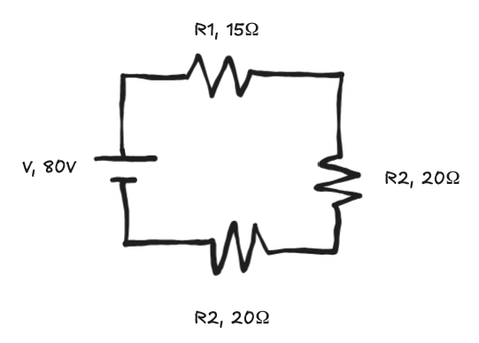
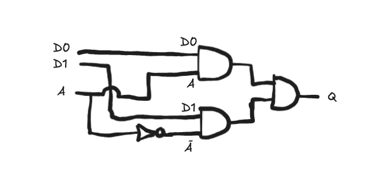
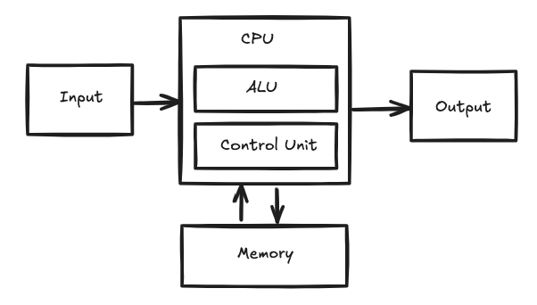

I'm starting this review by immediately telling a digression about my personal life. I promise there's an actual review of [Code by Charles Petzold](https://www.codehiddenlanguage.com/) in here. Bear with me!

### Electrical Engineering

I started undergrad as an electrical engineering student. I wasn't really sure what I wanted to do with my life, but I was intrigued by circuit diagrams. They're fun little algebra-ish puzzles to solve. And you abstractly learn how electrons move around and interact with various components.



### Computer Engineering

The electrical engineering curriculum shared a boolean logic course with the computer engineering curriculum. I found I enjoyed this new puzzley feeling more than the calculus my electrical engineering courses were heading toward.



One of the coolest classes I remember from my computer engineering curriculum was programming a super simple Von Neumann architecture machine on an FPGA. Going from logic gates to an accumulator to a really dumb computer that could do math on some seven segment displays is awesome.



I liked this more "practical" feeling problem solving over the "abstract" solving of math equations. I was building a _machine_ now instead of just doing calculus. <Note>It's kinda funny to think about that perception now, electrical engineering feels like it would be much closer to "reality" than working with computers. Instead, I'm working with a digital abstraction over top of reality where I get to mostly pretend everything is a yes or a no.</Note> I decided I'd go for a double major, with electrical AND computer engineering instead.

### Computer Science

Then, I ended up in my first programming class and found what I really loved. <Note>Okay, I probably didn't like _LOVE_ the idea of computing a factorial instantly? This is one of the earliest memories I have of a problem we solved in my intro to programming class though. I'm sure we must've had some lectures about loops and variables and conditionals and all that first.</Note>

```ts
function factorial(num) {
  if (num <= 1) return 1;

  return num * factorial(num - 1);
}
```

From here, I switched my major a final time to computer science. And, I had done enough computer engineering on the way to get that degree as well. No more math for me <Note>Ironically, now that I've been into game development and functional programming I find myself wishing I'd cared a bit more about math these days. I'd love to find time to get into linear algebra, matrices, and geometry again. Maybe some graph and set theory. One day! I'm sure of it!</Note> - I want to solve problems in human terms!

### Layers on layers on layers

I work with web tech these days, which is at least a dozen layers of abstraction above those classes where I built an accumulator or an operating system. I'm so glad to get a chance to engage with a bunch of these intermediate layers again in Code. (See! The review is starting!)

First you send electrons down a wire. Then you pattern those into signals to transmit data. You combine the signals by soldering wires so they can perform computations.

You standardize those wire patterns into microchips. You combine chips to get microprocessors. You start programming these processors with an assembly language instead of hard wiring them.

Turns out that's pretty involved. So, you use something like C to bring the program closer to your problem space. You want to think less about the intricacies of your machine while solving problems so you layer on an operating system. Now you can use an even higher level language to get closer to your problem domain.

_Now,_ we don't even want to know what kind of computer we're running on. We built a browser sandbox on top of our operating systems and ship the same code to all sorts of devices.

These layers aren't something I explicitly use in my day to day work. But, being reminded of them gives me so much awe that we're able to accomplish anything without exploding from the complexity.

### Code is very good

Code is a tour through all of these layers of computing from electron to JavaScript. This book is the first time in a long time I feel like I've really gotten to bask in all that computer engineering again. It refreshed me on what I'd learned long ago and I think it would serve as a wonderful primer.

Code covers more than just the layers I listed, and in much more detail. If you've ever been curious about what is going on down the stack from you, Code is a great place to find out.

If any of this post sounded interesting, check out [Code by Charles Petzold](https://www.codehiddenlanguage.com/)!
