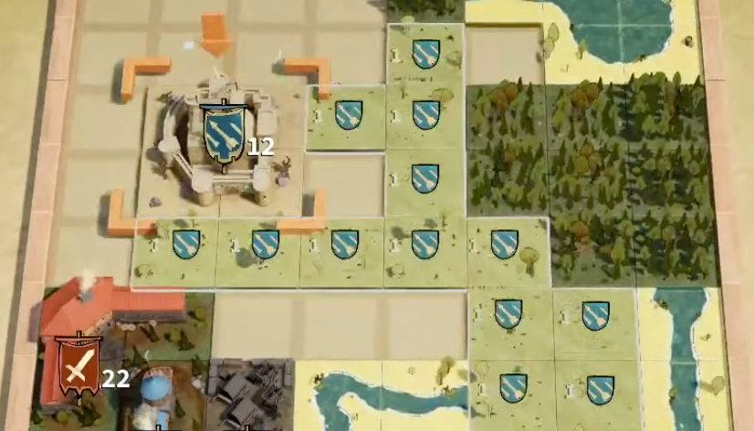

## Drop Duchy

I've been watching [Voyix](https://www.youtube.com/watch?v=yetXqPNbobI) play [Drop Duchy](https://store.steampowered.com/app/2525310/Drop_Duchy/) a bunch since its recent release. It's a really engrossing game.

If you haven't seen it, Drop Duchy is a roguelike where the levels are sort of turn-based Tetris crossed with a tile laying game like Carcassonne. You stack tetromino shaped buildings and terrain on a narrow grid. You're trying to balance completing lines for resources and optimizing your building placements to gain more troops than your enemy.

I've noticed some of the mechanics coupled with lack of undo lead to frustrating mistakes. I'm curious to explore that frustration and what might be changed to ease it. I'm not trying to "fix" Drop Duchy, just trying to understand the impact of design decisions.

> Drop Duchy game board, late in a round

## Adding complexity to keep turn based gameplay interesting

Trying to manage the chaos of dropping pieces in Tetris as they continue to fall faster and faster is fun. When you place a piece in the wrong spot, you either have more fun trying to recover or fail quickly and try to do better next time. It is fun to identify an ideal location for a piece, but the puzzle would lose its charm quickly without time pressure.

Drop Duchy removes this time pressure. Then, in order to make the puzzle more interesting again it layers a ton of new mechanisms on top. You're no longer just considering the risk of waiting for the perfect I piece or if you can pull off a T spin to finish off row. Now, you also have to ensure your Watchtower is in range of as many plains tiles as possible while avoiding aligning it with the enemy Training Camp.

In Tetris, all that matters is the position of the piece you're placing and how that plays into the next piece and what you have banked. It is very easy to hold all this information in your head (until the game speeds out of your control). You never need to remember that 16 pieces ago you placed an enemy camp that will cause you to lose the round if you align one of your pieces with it later.

Drop Duchy has a lot of pieces like this enemy camp that you just have to try and keep in your mind the whole game. Sometimes a piece placement is trivial, you're just riding out the clock. Sometimes you have to consider how a placement affects 4 or 5 other pieces on the board. It is not always easy to remember which placement is a high stakes one.

Some example mechanics from Drop Duchy:

- Placing your military building aligned in a column or row with a Training Camp will give you bonus troops
- Placing a plains within two tiles of an enemy Watch Tower will give your enemy bonus troops
- Placing a Wood Clearer will turn Forest tiles into Plains tiles that retroactively give your enemy Watch Tower troops if adjacent
- The Horse Stable gives you bonus troops based on the distance between it and the nearest building in the same row

I really enjoy the puzzle of optimizing all these conditions and placements. It is especially spicy to decide when it is worth conceding something to your opponent to set up something better for yourself. "Should I give troops to my opponent's Watch Tower to pull of a sick Wood Clearer + Farm combo? I do really need food to upgrade one of my buildings right now and I can _probably_ pull off a good Horse Stable later to make up the difference..."

These systems are fascinating... when you remember to account for them all.

## When is making mistakes fun?

A big part of what I like about games is learning how new systems of rules interact. If I make this apparently good move now, does it accidentally tank my run 15 moves later? How do I even decide what _is_ a good short term move at all? My favorite games reward continued layers of discovery. Moves I thought that were strictly good actually have trade offs I wasn't aware of as a beginner to the game.

Learning all these intricacies necessitates making a whole lot of mistakes. In fact, once I stop making mistakes and start feeling like I have "solved" a game (erroneously or not <Note>Sometimes I think it is easy to _think_ you have solved a game when in reality you're too new to understand other better options. That's a whole different interesting topic though.</Note>) I lose interest quickly. I get bored once I run out of mistakes to make!

Drop Duchy's complex interlocking mechanics coupled with the push your luck element <Note>I first ran into the phrase "push your luck" as board game mechanics jargon. It's the core tension of the random pieces in Tetris. Will I get the piece I need in time? Should I hope for an I piece or just sacrifice this opportunity?</Note> guarantees there's no shortage of mistakes to make. Not all of the mistakes you can make in Drop Duchy feel rewarding to me though.

I think this comes down to intentionality. If I make the choice to go for a risky play and then it doesn't pay off - that is a good mistake. If I bury an enemy Training Camp in the corner of the map and then at the end of the game forget about it and accidentally align a building, that feels bad.

Trying to hold a lot of information in my short term memory isn't a challenge I enjoy. When I get punished for failing to do that, it feels like I made an unintentional mistake. I _intended_ not to align anything with that Training Camp, but I made that intention so long ago I forgot about it entirely. Now I am rudely reminded of failing to do what I intended when my final misplay causes me to go from a victory to a defeat.

### Krak Des Chevaliers example

The Krak Des Chevaliers is the building in Drop Duchy that inspired this post. You get a troop for each tile in the smallest space of contiguous tiles touching the castle. This can lead to really cool and tense plays as you try to string a long chain of one terrain type and keep other types away.

> The Krak Des Chevaliers gaining a troop for each contiguous plains

Because there's so many things to consider in Drop Duchy when you place a piece, you tend to try and move things out of your short term memory by marking them as "solved". I set up my big plains region, so I'm done with the Krak Des Chevaliers now. In reality, you're not quite done. You can still mess it all up.

It's so easy to set up a big contiguous region of plains like above and then accidentally ruin it by carelessly dropping a forest on top of the castle several pieces later. You go from 20 extra troops to 4. A mistake like that can end your run.

The Krak Des Chevaliers also doesn't display the calculation of total troops until the end of the round either. You might not even notice you messed up til 10 minutes later!

This kind of "oh shoot, there was no reason to do that" mistake, where you're busy thinking about micro-optimizing some tiny gains with your current piece and accidentally lose the whole war feels bad. As soon as you notice, you'd happily forgo the other miniscule optimizations you were working on, but you cannot. There's no undo. And even if there were sometimes you don't notice until you'd have to undo half the game.

## Mitigating accidental mistakes

I am assuming that we even _want_ to mitigate accidental mistakes where possible. Perhaps that's an important part of this game's tension. It is certainly core to the underlying Tetris mechanics this game is inspired by. Does removing some of these ruin the vision for this game? Does it make it into a different game altogether?

Maybe trying to remove these mistakes wouldn't be worth it since they'd ruin some of the interesting mechanisms this game has.

There is value in making mistakes. Maybe these mistakes are not just to my particular taste. Perhaps others don't mind them or even appreciate that they're in the game.

For my own taste, I still think its worth exploring how to mitigate these accidental mistakes.

### Undo

The obvious mitigator in games like this is adding an undo feature. This helps in the case where you misplay and then immediately recognize the mistake.

This can also give the player permission to just try stuff and see what happens instead of trying to identify every possible outcome up front.

I'm not sure this alone would really solve the mistakes I see in Drop Duchy. You don't always realize you made a subtle, silly mistake until the round ends.

Additionally, every time you place a piece in Drop Duchy you see a new upcoming piece appear. If you added undo, you'd either have some information you shouldn't about an upcoming piece or get to reroll a bad piece for free.

### Quicker gameplay sessions

Drop Duchy's roguelike structure exacerbates the painful feeling of a mistake. Instead of just losing a 10 minute round due to a silly mistake, you have potentially wasted an hour long run. And then due to the randomness, you might never get to try this same scenario out again.

Putting the gameplay for these levels into a different wrapper could alleviate the weight of the mistake. This is obviously a pretty drastic change if you want to change the meta structure.

I'm a little over long run based games right now. I'd love to see indies experimenting with more interesting meta structures.

### Mechanical changes

I think that you could re-consider how many of the pieces in this game are designed to prevent a lot of these cases. One example, with Krak Des Chevaliers - it could pick the largest contiguous region instead of the smallest. You would no longer be able to accidentally ruin your building by placing a small region. This definitely changes the texture of the building. Maybe it is less interesting now? Maybe it is overpowered? But, I do think this would save players a lot of grief.

I did this with [Island Maker](https://rmkubik.itch.io/island-maker), a tile placement game I made, by ONLY allowing effects to happen when you place a building on the grid. Nothing happens retroactively. This is punishing in some ways. It matters if you place the Turnip first or the Farm first. You can only harvest if you place the Farm second.

> Placing a Farm next to a Turnip in Island Maker

It is easier to be strict about placement order in Island Maker since the placement constraint is much looser. You can place a Turnip in an empty field and then later on go back and place a Farm. This is because all spots on the grid are always available to be placed in.

Drop Duchy doesn't have this luxury due to the core Tetris stacking mechanic. You can only "save" a piece placed on the board or in your bank for so long before you have to bury it. This is essential to keep the cool push your luck feeling working.

Because it is harder to order the placement of your pieces, I'm not sure the Island Maker solution of "only have effects trigger on the piece that is placed" would work as well. It's far more generous in Drop Duchy to allow you to order the pieces in either way.

You also have much less control in how the pieces are ordered in Drop Duchy. Everything is stuck into a random pool and comes out however your luck shakes out. This can set you up for amazing combos or make some placements you'd like just to be totally impossible.

In Island Maker, you start with a much smaller initially random queue and then new pieces are added to the queue as you take intentional actions to add them. Then you can also inspect the entire queue and see what's coming down the pipe, and plan accordingly.

### Better feedback

Some pieces in Drop Duchy convey what they're doing and how they interact with each others. Some do not. I wonder if there are ways to signify these effects better.

In particular, Drop Duchy doesn't show "current" totals for values that change as the round progresses. Instead of _only_ computing the strength of a dynamically computed building at the end of the game, recompute it after each placement. I would imagine this isn't in the game because of a technical limitation vs. an intentional design choice. Who knows though, perhaps the dev prefers the player to try and hold that in their head.

This topic always reminds me of Justin Ma and Matthew Davis talking about how [Into the Breach's interface was a nightmare to make and the key to its greatness](https://www.rockpapershotgun.com/into-the-breach-interface-design). <Note>I first heard Justin Ma talk about this on the Eggplant Show Podcast, back when it was still the Spelunky Showlike. [12: Into the Breach with Justin Ma](https://eggplant.show/12-into-the-breach-with-justin-ma).</Note>

> “Our requirement that the player has to understand what’s going on in any situation restricted our game design options considerably,” says Ma.

> “I personally don’t like having to investigate shoot radiuses every other turn, moving a unit to check I can hit from there or to count tiles,” says Davis. “It becomes unmanageable to hold in your head and to eyeball what can hit what.

> “Just as a game design principle, we would sacrifice cool ideas for the sake of clarity every time,” says Ma.

They talk about cutting out otherwise interesting mechanics because they couldn't figure out a way to display them to the player. I don't think this is strictly "better". You lose out on those cool ideas that would still be interesting to explore even if they have rough edges.

How much can you sand those rough edges down before they lose everything interesting?

## Trade offs in design decisions

I find it interesting to interrogate design decisions you disagree with in others' work. <Note>Or your own work from a while ago, sooo many questionable decisions there. There's nowhere to hide in "oh, maybe the dev was just going for this awkward feeling". Nah, it was just a weird choice!</Note> It is especially interesting when their choices contrast with ones you made in your own work. My first instinct is usually "wow this is wrong", but fighting that off and digging in is really enlightening.

You never really know for sure why a developer made a specific choice. Did they even make the choice intentionally? Am I missing some really important implication of that choice and just focusing on a relatively unimportant symptom? There's no way to know for sure just by inspecting the game. <Note>And probably not a way to know for sure by asking the developer either. We make SO many choices when we create games. It is almost impossible that every single one of them was made with deliberation. I suspect a majority come down to a developer's intuition and taste.</Note> It is fun to try and speculate though!
