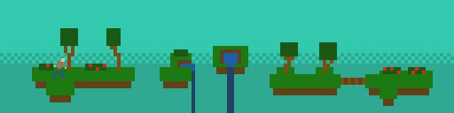
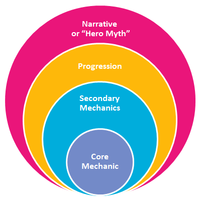

I’m going to take a look at the design of a project I’ve been working on off and on for a while now. It was originally created as part of a [month long game jam in January](https://itch.io/jam/jamuary). Unstable began its life as a digital art piece. I wanted to use an art style that I felt confident in producing assets for by myself.

The original mock-up of Unstable

From there the game slowly grew into something that was actually interactive and had moving pieces. I just started writing code around this art and watched where it took me. I’ve heard this sort of phenomenon referred to as “bottom up game design”. It doesn’t start with a plan or an end goal, it just sprouts out of nothingness and you help it take shape along the way.

I’m hitting the point where I see the problems in this method though. I don’t know where the endpoint is and keep making arbitrary decisions. Without a central vision or goal (besides to finish the thing) it’s getting harder to decide what gets cut or what needs to go into a level.

So in the spirit of trying all kinds of different methods of design to find out what sticks I’m going to take a look at one [system](https://web.archive.org/web/20150417192059/http://www.funstormgames.com/blog/2012/06/designing-around-a-core-mechanic/) shared with me on [twitter](https://twitter.com/matthackedit/status/852266889002733569) by a friendly, helpful dev (who makes an awesome [podcast](http://www.lostdecadegames.com/lostcast/) you should check out).

The tl;dr is that you can look at games as a series of layers centered around supporting a central core mechanic. The more these layers can interact and support each other the better.

The article has some good examples, like this analysis of Mario:

I wanted to take a stab at applying this model to Unstable and seeing what insight I could glean about Unstable’s design.

**Core Mechanic:** Moving around

When you boil it down, Unstable is all about moving your character around the screen, across the bridges, past the enemies, and through the portals.

**Secondary Mechanics:** Avoid enemies, get coins, and study the levels patterns

I believe that these all work very well with the core mechanic. They all cause the player to change how they move throughout the level in different ways.

**Progression:** Beating levels and beating hubs

I think the over world style of moving (just as you do in game) between portals to go to new levels and advance to new hubs is a good way to keep the core mechanic incorporated. I’m sure there are better ways to incorporate this further, and I’m looking forward to discovering new methods.

**Narrative:** The world is falling apart around you revealing the unstable machine beneath

This is the layer at which Unstable starts to stumble. Since I approached this game with that bottom up design silly things like story line, narrative, and even the game name got tacked on because it seemed like they were needed. Since I was missing any sort of plan from the beginning I didn’t know where to go!

I think the takeaways here are that starting from the bottom with no core plan of development and cobbling code and assets together lets you get started quicker but makes finishing harder. I’m hoping I can take some time now to remedy this situation and come up with a plan to get this project out the door! If you made it this far and want to check out the project you can find it on my [itch.io page](https://law5guy.itch.io/unstable). If you’ve got any feedback, questions, or comments I’m on [twitter](https://twitter.com/ryrykubes)!
