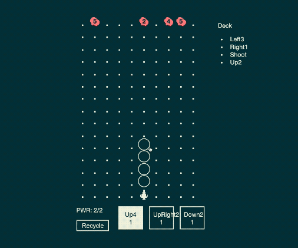
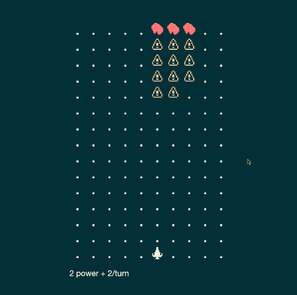

[The JS13k jam](https://js13kgames.com/) is one of my favorite game jams. The challenge is to make a game in JavaScript, in under 13kb over the course of a month. I really enjoy the explicit challenge of making something small in JavaScript. I love the language, and this jam challenges me to use lighter parts of the ecosystem. Additionally, month long jams are my favorite scope these days. They give me plenty of time to ruminate and be unproductive.

I just finished my entry for this year's jam with my friend [Brendan](https://twitter.com/icynotesdx). We made a turn based shoot 'em up game called "[Rocket Jockey: Captain Pick-a-Card's Great Escape](https://js13kgames.com/entries/rocket-jockey-captain-pick-a-cards-great-escape)". You play action cards to dodge asteroids and try to reach the end of the board.

This jam was packed with highs and lows for me, so I wanted to take some time to share what I learned.

## The pitch

I have been wanting to do a game with the concept "what if it's a shoot 'em up (a la [Galaga](https://en.wikipedia.org/wiki/Galaga) or [Hyper Echelon](https://store.steampowered.com/app/953330/Hyper_Echelon/)), but turn based?" This genre has always fascinated me; however, I'm not particularly good at them. I wanted to take the near misses and skillful navigation from this genre into a turn based environment. Fortunately, the theme this year was "Space" so this idea lined up perfectly.

## Prototyping the idea

Over the past game jams I've participated in, I have gotten pretty good at the initial phase of prototyping my first idea. This is my comfort zone! Especially in a longer jam like this where there's plenty of time and I'm using tools I know and enjoy. These are some things I've found work for me during this phase.

### Art limitations

When I'm responsible for the art of my games I find it best to steer into my limitations. Currently, that means sticking to small pixel art sprites with low levels of detail. Additionally, I like to use a color palette that is as limited as possible. For this project, I chose [AYY4 by Polyducks](https://lospec.com/palette-list/ayy4).

I picked this palette because it had a dark "space" color, a bright "star" color, and a red explosion or enemy color. I felt optimistic I'd be able to work within these constraints. In the end, I didn't even end up needing the yellow!

### Why add cards?

Shoot 'em up games are an interesting blend of strategic pattern recognition and real time reflex-based execution. In a turn based game, executing a maneuver becomes trivial (assuming the user interface is well designed). This means the strategy layer of the game needs to carry the whole game by itself.

Later on in the jam, I prototyped a version of [Rocket Jockey without card-based movement](https://remove-deck-building--tbshmup.netlify.app/). Without cards the player can basically move anywhere they want. The only limitation is the players ability to spot a potential path. I was unsure how to make this movement scheme interesting. There were either so many asteroids that it was impossible or too few and it felt trivial.

Adding card based movement patterns prevents the player from taking an obvious clear path. Instead, they have to make the best of the hand they're dealt. This introduce an element of planning around randomness that the player can learn to mitigate as they play. By introducing this uncertainty, we allow for interesting decisions and uncertain outcomes without needing the traditional execution-based constraints in shoot 'em ups.

Here's the first version of [Rocket Jockey with a card based implementation](https://first-card-implementation--tbshmup.netlify.app/) after the initial prototyping phase. You can tell something is interesting there, but it's not quite right yet. This is where I began an "iteration" phase and my friend Brendan joined me.

## Iterating on the prototype

After doing a lot of shorter jams, I've become pretty comfortable throwing together an initial prototype. It's harder to practice iterating on a game's design in a couple days though. This is an area where I feel like I have a lot of room to grow as a designer still.

How do I grow a fun prototyped seed into a full fledged game? Thanks to JS13k's longer timeline, I got another chance at answering this question. As with a lot of game dev, this amounted to making mistakes and fortuitous discoveries!

### Starting with too grand of a plan

While building Rocket Jockey I fell into a trap of looking at other cards games I play, like [Magic the Gathering](https://magic.wizards.com/en/articles/archive/feature/what-magic-gathering-2008-08-08) or [Slay the Spire](https://store.steampowered.com/app/646570/Slay_the_Spire/). I started implementing systems from those games because I felt like they were "supposed" to be in card games. I added rough versions of mechanics like mana costs, deck building, and map traversal.

Going down this road, I realized I had a bunch of half baked mechanics and none of them were particularly fun. The basic "asteroid field" map was still the same [pretty trivial empty version](https://first-card-implementation--tbshmup.netlify.app/) I linked earlier. Energy was interesting because it limited the player's choices each turn. However, I only had one set of cards that played with. A simple "play 2 cards per turn rule" would prove to be equally effective and simpler to implement later on.

These additional mechanics didn't make the initial seed of an idea any more fun. They just added several more systems I now needed to make fun too! Instead, I think I should've focused on the systems I had and added new ones only to specifically address the original prototype. Seeing cards and immediately jumping to add systems from a 15 year old trading card game was a mistake. I might have had longer than a weekend, but I didn't have that kind of time!

### Bring on the collaborators

Part way through the jam, I had my pile of deck building mechanics and no interesting gameplay. I was very discouraged since I'd spent so much time implementing all of these mechanics I put the project aside for weeks.

During this break, I shared what I built with some other designer friends, [Brendan](https://twitter.com/icynotesdx) and [Mickey](https://twitter.com/mickanio). They had a fresh enthusiasm for the idea that I had lost. Their excitement was _incredibly_ helpful for getting me to back into development. This was yet another reminder that building a game in isolation is incredibly challenging and I should reach out much sooner.

In addition to the motivation, Brendan joined me in the last weekend of the jam and helped unblock me a TON on the design front. His skillset plus fresh perspective allowed him to break free of the over-ambitious deck building expectations I had piled onto the game.

With Brendan's advice and design skills, we added many small improvements to the card-based shmup seed I'd planted. I'm not sure I would've found my way here on my own. And if I did, it certainly would've taken me way more time than I had available in the jam!

## The final cut

The [submission version of Rocket Jockey](https://js13kgames.com/entries/rocket-jockey-captain-pick-a-cards-great-escape) ended up similar to the original card based prototype. There were several important tweaks and additional features that really helped it come alive though.

### Constraining the player

The original prototype gave the player too much freedom without imposing any interesting constraints on them. Cards had multiple options so were almost always useful. Enemies were infrequently spawned and their speeds had a wide variance. This meant there were almost always gaps between them where the player could fly.

Instead of a few cards that could do a lot of things, we made more cards that could only move the player in a single direction. These values were chosen fairly arbitrarily, but we made sure to choose a fairly even spread of directions and speeds. I would love to understand why these numbers worked so well in the future!

Even with these constraints, the player needed more challenge. The pathing was less direct, but not much more challenging. We found spawning more enemies every turn instead of every other and giving them slower speeds created more interesting patterns for the player to navigate. I find it very interesting that our final enemy count ended up being something like 4x the original quantity I started with. Definitely a good anecdote for the design advice "if something feels off, don't increase by small amounts, double it!" Or even quadruple it!

### Empowering the player

Now that we'd added some interesting constraints, we wanted to add some new fun mechanics to return just the right amount of control to the player.

The first new mechanic we introduced was the Shoot card. It allows a player to shoot a projectile and destroy asteroids. This lets the player create their own paths through the asteroid field when a pattern they couldn't navigate naturally is generated.

At this point, we decided it was a good idea to show the player all of the cards in their deck so they could plan further ahead. Maybe you wouldn't want to fly close to the asteroid spawn zone if you knew you didn't have your Shoot card coming up soon.

Once we made the deck visible and got a taste of planning ahead with it, we really wanted a way to manipulate our draws. For example, there were a lot of situations where you'd want to remove a dead card for a chance at a last second dodge.

This is when we added the final mechanic, recycling cards. Once per turn, the player can choose to discard one of their cards and draw a new one. This mechanic lets the player methodically plan ahead or save themselves by the skin of their teeth. It had so much mileage and once it was in, we couldn't image the game without it!

### Why play again after you win? Streak scoring!

We had a pretty fun game shake out of all these improvements. The more we played, the more we kept learning about interesting situations or card interactions. And we had landed at a decent difficulty level where you could generally win two out of three games. The problem was, there was no real reason for a casual player to stick around and have fun learning these interactions.

Enter Brendan's amazing suggestion of implementing something similar to the streak scoring in [Michael Brough's Cinco Paus](https://smestorp.itch.io/cinco-paus) (give this game a chance, it's amazing). In Rocket Jockey, this amounts to a win streak counter. Every time you beat a round, your win counter increases. That's it! It's so brilliantly simple, but it instantly gives players a reason to keep playing and learning the intricacies of the game's systems. It also increases the pressure of the game as your streak gets higher without making any mechanical adjustments.

## Check Rocket Jockey out!

It was a lot of fun working on this project! I'm really proud of the game we ended up with. If you're interesting in going on an adventure with Captain Pick-a-Card, [give Rocket Jockey a play.](https://js13kgames.com/entries/rocket-jockey-captain-pick-a-cards-great-escape) Then, let me know what you thought [on Twitter!](https://twitter.com/ryrykubes)
