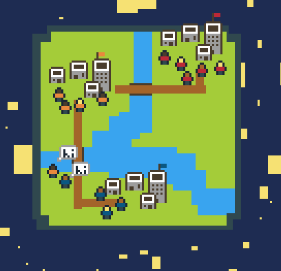

## Tools & Tech

A Social Network was written in Phaser, a javascript game development framework. I used MAMP to host the game locally during development. I wrote all of my code using github’s Atom. Art assets were designed and turned into sprite sheets using Pyxel Edit, picked up for cheap in a humble bundle. The rather pitiful SFX I scrounged up were generated using BFXR. LICEcap was the real MVP for incredibly easy gif capture and recording to share on twitter.

## Game Design

The theme for Ludum Dare 38 was “A Small World”. The first place my mind went (and many others’ if you look at the game results) was to create a small planet. The other angle that I felt was common was the social implications of the theme. I had a brief image of a social media creeping game, but settled on modeling the connections of a growing social network amongst people. The appeal of a creating a small planet with a nice starscape lived on as a decoration element.

## What Went Well?

Sharing progress a lot in Slack, Twitter, Discord helped me stay motivated. Sharing my progress along the way got me some small tips and thoughts about the project. Seeing other people interested in my game the game helped me keep up the motivation to finish the weekend with a product. Being able to record gigs easily was a big boon. Sharing is so much easier when it's so intuitive and painless! The people at Itch.io wrote an [article](https://itch.io/t/12612/creating-a-gif-for-your-game) about other easy gif creation tools.

I made it a point to have something super minimal running by first night (stayed up too late though). In addition, I had chosen an artstyle and had a mockup to work off.

Since this was my first solo game jam, I wanted to keep my scope incredibly small. Thanks to this, I managed to finish my MVP by the afternoon on Saturday. This gave plenty of time to polish the game. (You'll see I didn't use this time very well... I talk about that in the next section!)

Concept Art!

Very basic MVP

Waking up early on Saturday and getting it of the apartment to hang out at a coffee shop was great. It really helped to not just sit at home in front of my monitor for the entire jam. Getting outside and working in a different place helped me out with imagination and creativity! Especially since my theme was social, being out with other people around worked out nicely.

## What Went Wrong?

I did not come up with a good solid game mechanic. My theme interpretations were not anything special and didn't have a central mechanic to revolve around. In the past when I've done jams with other people, it was easier for us to collectively arrive at fun ideas. It was much harder without being able to lean on others. Creativity is a skill that I need to practice more. Raph Koster has some interesting points on the subject:

<iframe width="560" height="315" src="https://www.youtube.com/embed/zyVTxGpEO30" title="YouTube video player" frameborder="0" allow="accelerometer; autoplay; clipboard-write; encrypted-media; gyroscope; picture-in-picture" allowfullscreen></iframe>

Creating SFX and music is hard for me. VERY hard. I knew this and left the second half of Sunday to work on the subject. But this was nowhere near enough time to actually learn how to create decent audio assets. I ended up hitting randomize a hundred thousand times on BFXR and ditching the thought of having a sound track. This continues the recurring theme of completing a solo game jam requiring you to have knowledge of skills outside of your forte.

The core idea of my game sounded interesting, but didn’t pan out very well. I did not have a clear goal for gameplay in mind which made it suffer. On top of this. my implementation ended up being a bit buggy and annoying to play with. I ended up adding some sandbox features like skipping between levels and adding endless amounts of people to try and make it a little interesting.

I left myself plenty of time to sleep this time around, but I ended up not sleeping at hours similar to how I normally do. This had me waking up too early in the morning after staying up late. It's not just getting enough sleep that matters, you’ve got to consider your normal sleep schedule too!

## Conclusion

Working alone is harder than working on a team. You really find out what your personal weak points are. I didn’t have much appreciation for developing skills outside of my wheelhouse. Its very easy to discard other skills when you’re working with talented people who can handle those departments, but a solo jam is a whole different animal. To succeed at a solo game jam like Ludum Dare you really need to practice all facets of game dev! You can play the "finished" product in your browser here https://law5guy.itch.io/a-social-network.
