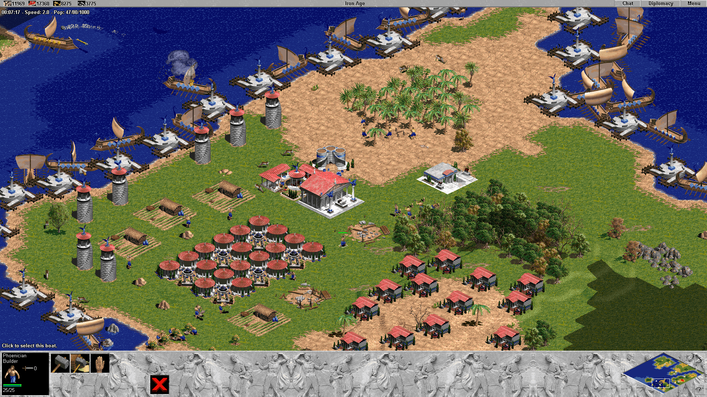
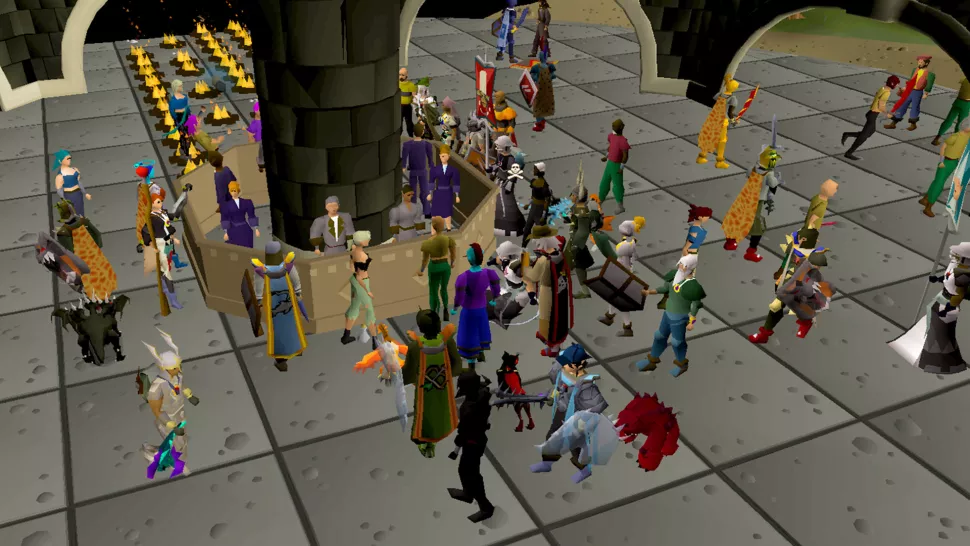
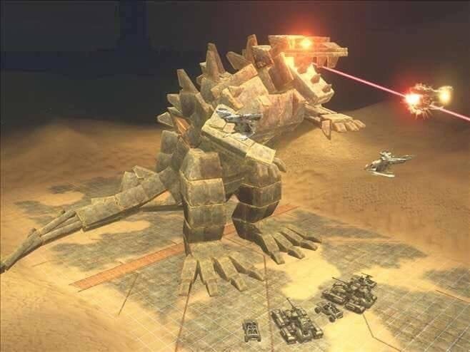
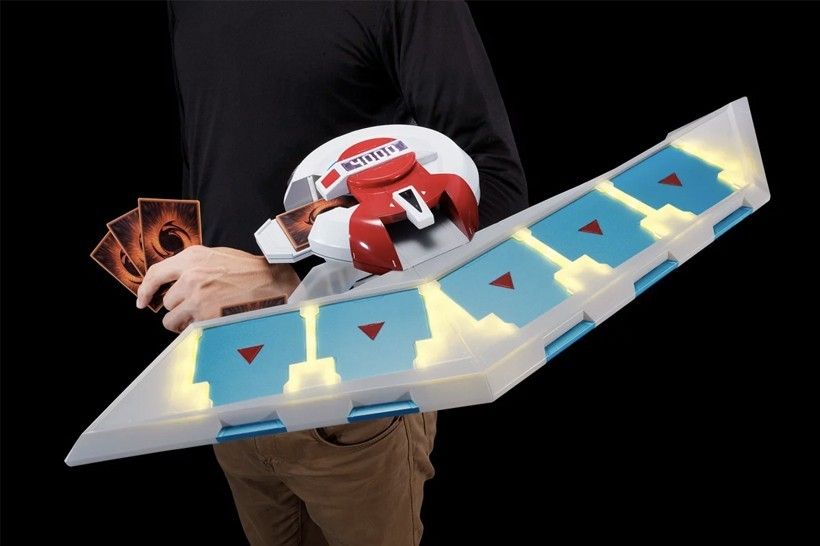
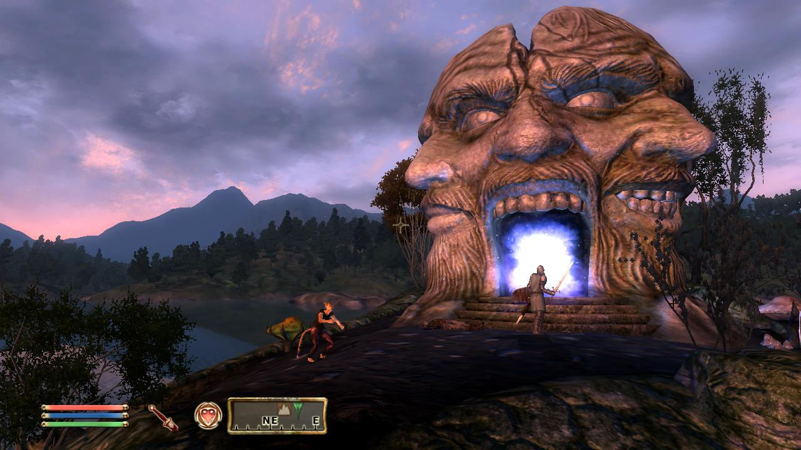
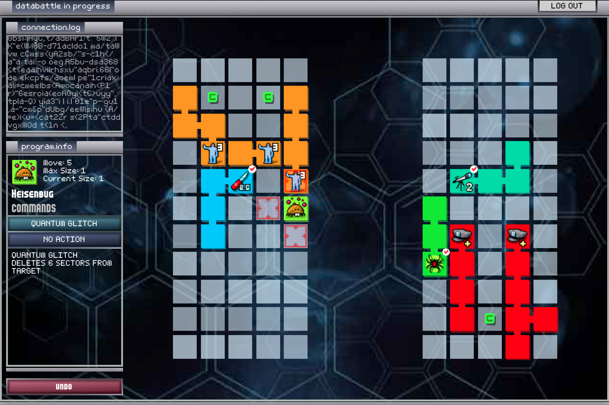
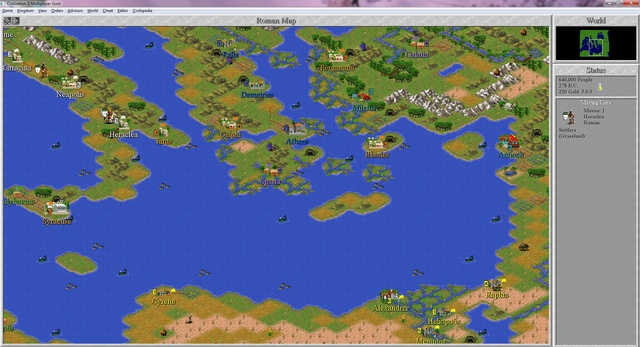
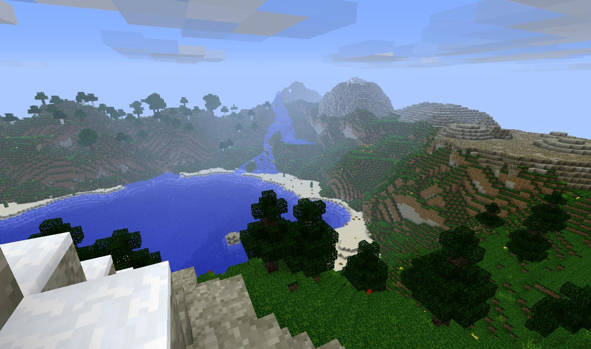
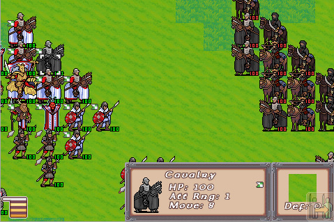

I listen to a gaming podcast called [Gametalk](https://soundcloud.com/user-749587577) put on by some of my friends. Their 100th episode was titled “[The Games That Define Us](https://soundcloud.com/user-749587577/the-games-that-define-us)”. In this episode, they each listed the 10 games that had the largest impact on their tastes. This meant including not just favorite games, but the ones that introduced you to a genre. Or the one that got you started making games. I wanted to give this exercise a try. So here’re the 10 games that have most influenced my tastes as a gamer and game developer.

# My Most Influential Games

### Age of Empires

The first video game I can remember playing is the [original Age of Empires](https://www.ageofempires.com/games/aoe/). This was the first game I played local multiplayer against my brother. I loved building an empire and watching all the people move around their world. Age captured my imagination. For many years, the only games we had were RTS games. This game and others like it _were_ gaming for me.

Another important reason to include Age of Empires - it came with a map editor. I wouldn’t know it for a long time, but this was my first introduction to game design. I spent a lot of time building maps to play with my brother or against AI opponents.

### RuneScape

[RuneScape](https://oldschool.runescape.com/) was the the first MMO I ever played with friends. It was the way I hung out with friends online before Xbox Live. Free and running in a browser were hallmarks of my gaming experience in these days. I did finally end up convincing my parents to pay for a membership eventually though.

I was really drawn to the richness of RuneScape’s world and systems. Looking at the game as an adult with info-laden wikis it feels a bit hard to believe. But, as a child there was _always_ something new to see. My friends and I would stake out the best way to level our skills or make money, find out they were terrible, and then go dream up some new hare-brained scheme.

RuneScape was the first of these MMOs, but it led to me playing a lot of others in this time. They were almost all random free online ones like [Tribal Wars](https://www.tribalwars.us/) and [Chosenspace](https://web.archive.org/web/20071227084240/http://www.chosenspace.com/). The exception was when my brother and I got into [Guild Wars](https://www.guildwars.com/en/).

### Halo 3

The first console I had was the [XBOX 360 Elite edition](https://www.pcmag.com/reviews/microsoft-xbox-360-elite). I was behind the times amongst my friends and very excited to catch up. [Halo 3](https://halo.fandom.com/wiki/Halo_3) was where the action was. Everyone I knew at school was playing it. We played a lot of other FPS games like [Call of Duty 4](https://store.steampowered.com/app/7940/Call_of_Duty_4_Modern_Warfare/) and [Gears of War](https://gearsofwar.com/games/gears-of-war), but Halo 3 will forever capture that magical era.

Halo 3’s Forge mode was my next big introduction to making games. The tools didn’t give you a ton of power to formally enshrine custom game rules. But while playing with friends the honor system could be very powerful!

It was a lot of fun to create maps and play the ones friends had found elsewhere. The community around custom maps and modes in Halo 3 was amazing. This was the first time it was easy to convince my friends to play what I had made. Just select a new map or game mode and click start game.

### Yugioh

I am into a lot of card games these days, and I have to credit [Yugioh](https://www.yugioh-card.com/en/) as the origin. I remember opening my first pack of cards and seeing this giant [Crab Turtle](https://yugioh.fandom.com/wiki/Crab_Turtle). It needed a different special card to be summoned which I didn’t have. But I was fascinated, and now had a very important quest. Find a [Turtle Oath](https://yugioh.fandom.com/wiki/Turtle_Oath).

The mystery of opening cards and trying to build decks got me into the game. But the social aspect of sitting down to play with friends is what got me hooked. Playing card games with a dedicated group of friends is magical. You have a fun reason to meet often and get a chance to show off your cool new deck. You see your friends’ personalities expressed in the cards they choose. It’s a great way to hang out and bond.

### The Elder Scrolls IV: Oblivion

This was not my first RPG nor my first open world single player game. Those credits go to [Dungeon Siege](https://dungeonsiege.fandom.com/wiki/Dungeon_Siege) and [Assassin’s Creed](https://www.ubisoft.com/en-us/game/assassins-creed/assassins-creed) respectively. I chose [Oblivion](https://store.steampowered.com/app/22330/The_Elder_Scrolls_IV_Oblivion_Game_of_the_Year_Edition/) over those games in this list because this is the one I _still_ think about. This game was magical, especially The Shivering Isles DLC. I love how weird this game got to be while still being a big budget console release.

In addition to the freeing weirdness of this game, I love all of the side quests and worldbuilding. The Elder Scrolls was my first exposure to large scale worldbuilding. I loved learning about random characters and ancient gods. I really enjoyed how you’d find contradictory accounts of historical events as well. You really got the feeling you were uncovering history and not just being told what happened.

### Spybotics: The Nightfall Incident

A large chunk of my gaming time when I was younger was spent on flash game sites like [addictinggames.com](https://www.addictinggames.com/) and [miniclip.com](https://www.miniclip.com/games/en/#). These sites exposed me to a ton of different genres. I think this is probably where I first found puzzle and tactics games.

[Spybotics: The Nightfall Incident](https://brickipedia.fandom.com/wiki/The_Nightfall_Incident) is my favorite from that era. I’m choosing it as a stand-in for all of these web games. This is the first tactics game I can remember playing, which is a genre I like a lot these days. Units were sort of snake-like and their health occupied cells on the battle grid. It led to some pretty interesting body blocking and maneuverability concerns I haven’t seen in other tactics games. This one got its hooks in my deep enough that I made a game jam entry with the mechanic called [Status Code](https://status-code.netlify.app/).

### Portal

This is one of the first big puzzle games I played as a kid. I can definitely remember others I played online like [Rush Hour](https://www.google.com/search?q=rush+hour+web+game), [Cubis](https://zone.msn.com/en/cubis2/default.htm), and [Bloons](https://ninjakiwi.com/Games/Bloons/Bloons.html). This was probably the first one I actually owned and completed though. [Portal](https://store.steampowered.com/app/400/Portal/) is just a very good puzzle game. It’s one of those that even people who don’t always like puzzle games that much have still played. I do think Portal played at least a small part in paving my way toward narrative games like the [Stanley Parable](https://store.steampowered.com/app/221910/The_Stanley_Parable/) and [Firewatch](https://www.firewatchgame.com/).

### Civilization 2

This was the first [4X game](https://en.wikipedia.org/wiki/4X) that I played. It was installed on a computer at school and I couldn’t get enough of it. I never fully grasped all the systems and city management details. But there was something that really grabbed me about exploring and spreading your cities across a fogged map.

I didn’t get DEEP into this genre until I played around a thousand hours combined of [Civilization 4](https://civilization.com/civilization-4/) [and 5](https://civilization.com/civilization-5/) in undergrad. Systemic strategy games are a big part of what I like now and [Civilization 2](https://civilization.com/civilization-2/) gets credit as my first one.

### Minecraft

[Minecraft](https://www.minecraft.net/en-us) is the ultimate sandbox game and [the best selling game of all time](https://en.wikipedia.org/wiki/List_of_best-selling_video_games). The gameplay’s focus on creativity and discovery is right up my alley. The community around this game is what made the largest impact on me. I watched a lot of lets plays on YouTube of the game and played a lot of custom maps from the forums.

In Minecraft I “published” a creation for the first time and shared it with strangers. It was a custom survival map called “[Lazy Island](https://www.minecraftforum.net/forums/mapping-and-modding-java-edition/maps/1485827-surv-creation-new-world-lazy-island)”. I think was a pretty big step for me along my journey to becoming a game developer.

### Reign of Swords

Sometime during high school I got an iPod Touch. I never had a mobile gaming device before, so this was the first time I could game on the go. I played a ton of the popular games that everyone was playing like [Angry Birds](https://www.angrybirds.com/) and [Words with Friends](https://www.wordswithfriends.com/). Like web gaming before, mobile gaming also exposed me to a ton of new games and genres.

One of these games was a tactics game called [Reign of Swords](https://www.ign.com/articles/2008/10/06/reign-of-swords-review). It had some well designed, compact levels. It also featured a pretty interesting progression system that had you motivated to repeat levels to earn specific upgrade items. You could then upgrade your soldiers through a branching upgrade tree to get cool unique units. I chose this game for the list as a proxy for that early mobile gaming revolution.

# Honorable Mentions

- **[Chip’s Challenge](https://store.steampowered.com/app/346850/Chips_Challenge_1/)** - This is the first puzzle game I can remember playing. I only ever played it when I went over to a friend’s house though. I never knew what it was called until a few years ago!
- **[Assassin’s Creed](https://www.ubisoft.com/en-us/game/assassins-creed/assassins-creed)** - This is the first open world game I ever played and it totally blew my mind. The verticality involved in climbing through cities was particularly wild. I opted to include Oblivion as my open world game of choice this time though.
- **[Megaman Battle Network](https://megaman.fandom.com/wiki/Mega_Man_Battle_Network_3)** - I spent a summer borrowing a friend’s DS and fighting bosses in a Megaman Battle Network game. I never had a Game Boy when I was little, and this was the closest I got. As an adult I keep buying new weird handhelds to fill the void of missing out on them when younger.
- **[Dungeons of Dredmor](https://dungeonsofdredmor.com/)** - This was the first time I ever got into a Roguelike. I’ve never gotten into another one quite as deep. I keep playing them though and hunting for that next one that grips me.
- **[Zoo Tycoon](https://zootycoon.fandom.com/wiki/Zoo_Tycoon:_Complete_Collection)** - This was up there with Age of Empires (AOE) as my favorite game when I was little. Zoo Tycoon really captured the fun of messing with a simulation and then watching the results. I chose AOE over Zoo Tycoon because AOE was first. This game narrowly missed the list though.
- **[The Stanley Parable](https://store.steampowered.com/app/221910/The_Stanley_Parable/)** - This is the first narrative game I played. I enjoyed it a lot and it opened my eyes to that genre. Ultimately, I don’t play many story driven games so I opted to include Portal over this one. I think interacting with GLaDOS and escaping the Testing Facility in that game have some similarities with The Stanley Parable.
- **[Rimworld](https://rimworldgame.com/)** - This is the first time I played a colony survival style game. I’ve really enjoyed this genre since. It feels like a natural extension of me enjoying RTS games like Age of Empires and survival games like Minecraft though. So, I left this one off the list too.
- **[LEGO Creator](<https://en.wikipedia.org/wiki/Lego_Creator_(video_game)>)** - I had a ton of LEGOs as a kid and I really enjoyed a lot of the LEGO games as well. The LEGO Creator series in particular was a super cool toy. In particular, I liked [the Harry Potter themed one](https://brickipedia.fandom.com/wiki/LEGO_Creator:_Harry_Potter). It let you build with LEGOs of course, but the highlight for me was placing minifigures. They would all walk around and _do things._ This was definitely amongst the first sort of simulation/sandbox games I ever played.
- **[Dungeon Siege](https://dungeonsiege.fandom.com/wiki/Dungeon_Siege)** - This is the first RPG I can remember playing. I really liked this game and it was my first intro to dungeon crawling and loot gobbling. I don’t get into RPGs as much though so I left this one off.
