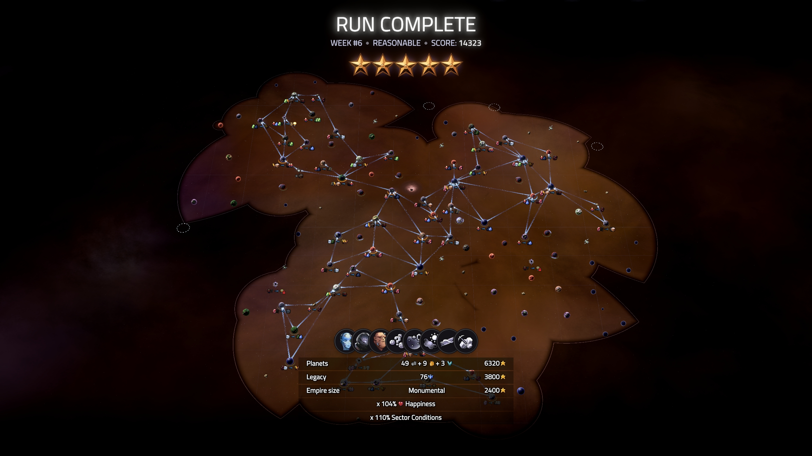

## What is Slipways

I've been playing a "condensed" space grand strategy game called Slipways over the past few weeks. It's been a lot of fun to return to a genre that I just don't have the time and energy to really get into any more. A run seems to usually fall in the 1.5-3 hours range for me, which feels like a reasonable amount of time to slot into a work week.

There's a cool "weekly ranked run" feature in Slipways. Each week, it generates a seeded run for everyone to play and compare scores. The weekly usually comes with its own unique scoring rules to shake things up too.

I've done the past couple weekly runs with some friends, and it's fun to discuss strategies and learn more about the systems in Slipways. After writing up a few of the things I learned after my latest weekly, I thought it would be nice to share them here too!

## Slipways Ranked Run: Week #6

Here's my run. It kinda turned around in the last few years. I thought I was going to end up in a solid 3-4 star area for a while. But then, I ended up getting all the way to just 2000 points shy of one platinum star.

I think this was close to a 1.5-2 hour run. I was trying to play more fast and reckless at first, but really started slowing down in the last few years. I want to see if I can actually make it to the "one run in 60 minutes" duration advertised on the Steam page.

I learned a few big things in this run:

1. Running a couple planets at resource shortage for a long time doesn't actually hurt as much as I thought if you can eventually satisfy them. I think they capped at -8% happiness each, then when I satisfied them close to the end it was around -3% each from "past shortages". Still probably not how you get the highest scores, but way better than I expected!

2. Darkened sector (the custom ruleset for this weekly) is hard! I think the visibility goes down a lot when you settle a planet and planning loops becomes very challenging. This led to a lot of long term shortages and it was hard to pick which planets to make into scanners (the darkened sector ruleset lets you colonize a planet as a scanner that clears a lot of the fog of war).

3. Picking tasks one at a time toward the end can be a solid strategy to eke out a couple extra tasks. Just because you only choose one doesn't mean you can't choose another single one afterwards. I pushed out a couple "make X planet type successful", one at a time, right at the end.
