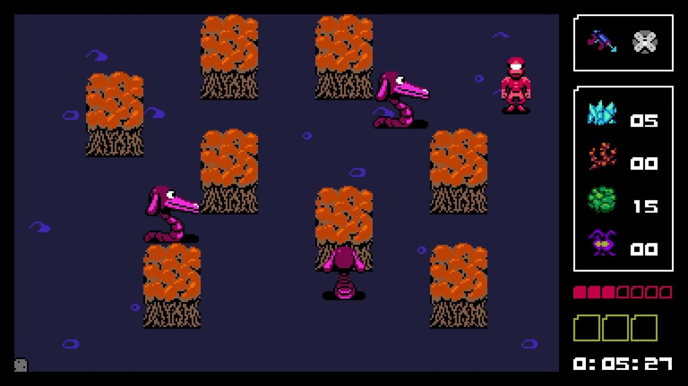

## What is it?

From the [Steam page](https://store.steampowered.com/app/1147860/UFO_50/):

> UFO 50 is a collection of 50 single and multiplayer games that span a variety of genres, from platformers and shoot 'em ups to puzzle games, roguelites, and RPGs. Our goal is to combine a familiar 8-bit aesthetic with new ideas and modern game design.

UFO 50 was developed by Derek Yu, Eirik Suhrke, Jon Perry, Paul Hubans, Ojiro Fumoto, and Tyriq Plummer.

## Feelings

{/* UFO 50 came out about a month ago and I've played it at least a few days every week. */}

I'm an apathetic gamer lately. I used to be into sampling random web games on a whim, but I've been sticking to a few main games and not much else this year.

{/* UFO 50 has gotten me out of this rut by giving me 50 games I know nothing about. But, I trust the dev team behind them all to try each game for longer than I'd trust a normal random game. I've played more games in non-standard genres for me this past month than I did all last year. Maybe the last couple years. */}

UFO 50 has been challenging me to climb out of this rut. I have no clue what suprise will be inside each little cartridge. All I get to go on is a pixel art icon and a title. It's very rewarding to push past the initial discomfort and confusion I feel trying to figure out each game.

> Avianos, Mooncat, Bushido Ball, Block Koala, and Camoflauge

I have felt pretty worn out this year, and I really appreciate the opportunity to put myself out there in this little way. Fighting for understanding instead of curling up and stagnating forever feels healthy.

### My fav

I think because of these emotions, **Planet Zoldath**, a weirdo randomly generated adventurey game has been my favorite experience of the collection thus far. There's not much to grab onto when you start it, but you find a little more footing on each repeated play. When you give it enough time, Zoldath reveals all these surprising systemic interactions. I didn't know what to expect with this one and found these discoveries delightful. <Note icon="👽">This game has been a bit polarizing in reviews of UFO 50. All of the weird janky bits of this experience made it even better for me. Unforgiving randomness. Weirdly opaque items. A sluggish walk speed. Fragile health bar. Very fertile ground for surprises!</Note>

### So much more to discover

> My UFO 50 cartridge progress (the gold ones are some of my favorites)

I'm around halfway through opening all the games in UFO 50. I've only beat 4 of them. I haven't even played half of them for more than 30 minutes! It is truly remarkable how large this collection is. I am looking forward to UFO 50's energizing companionship for months to come.
