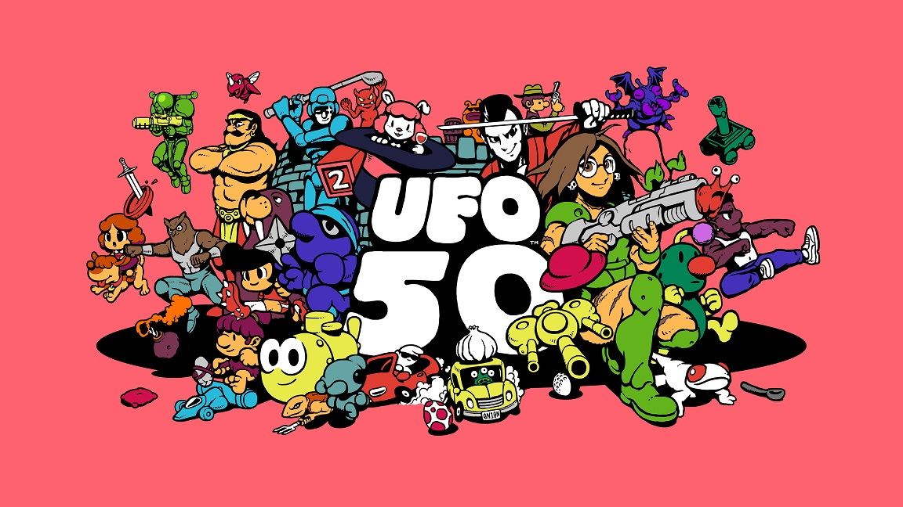
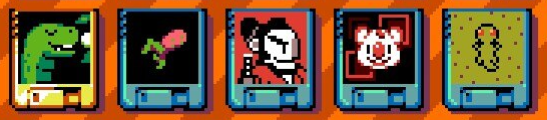
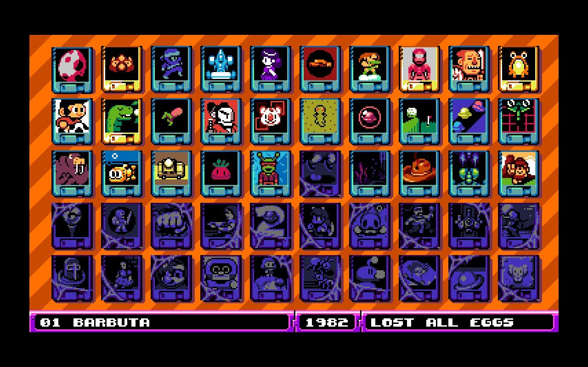

## What is it?

From the [Steam page](https://store.steampowered.com/app/1147860/UFO_50/):

> UFO 50 is a collection of 50 single and multiplayer games that span a variety of genres, from platformers and shoot 'em ups to puzzle games, roguelites, and RPGs. Our goal is to combine a familiar 8-bit aesthetic with new ideas and modern game design.

UFO 50 was developed by Derek Yu, Eirik Suhrke, Jon Perry, Paul Hubans, Ojiro Fumoto, and Tyriq Plummer.

## Feelings

{/* UFO 50 came out about a month ago and I've played it at least a few days every week. */}

I'm an apathetic gamer lately. I've had phases where I'll try random web games on a whim, but I've found myself sticking to a few main games and not much else this year.

{/* UFO 50 has gotten me out of this rut by giving me 50 games I know nothing about. But, I trust the dev team behind them all to try each game for longer than I'd trust a normal random game. I've played more games in non-standard genres for me this past month than I did all last year. Maybe the last couple years. */}

UFO 50 has been challenging me to get out of this rut. It's a curated box of weirdo games put together by developers I respect. Playing through this with friends and community has given me enough momentum to break through.

I haven't learned anything about these games outside of the UFO 50 itself. I have no clue what's going to be inside each cartridge. All I can go on is a little pixel art icon and a title. It's very rewarding to push past the initial discomfort and confusion I feel launching these games.

> Avianos, Mooncat, Bushido Ball, Block Koala, and Camoflauge

I have felt pretty worn out this year, and I really appreciate the challenge of putting myself out there in this little way. To fight for understanding instead of curling up and stagnating forever.

I think because of these emotions, Planet Zoldath, a weirdo randomly generated RPG style game has been my favorite experience of the collection thus far. There's kind of nothing to grab onto when you start it, but upon repeated play you keep finding a little more footing. The game reveals to you all these interesting systemic depths that are delightful because you have no pre-conception of what this thing you're playing even is.

> My UFO 50 cartridge progress (the gold ones are some of my favorites)

I'm around halfway through opening all the games in UFO 50. I've only beat 4 of them. I haven't even played half of them for more than 30 minutes! It is truly remarkable how big this collection is. I am looking forward to this game being a companion helping me out of my comfort zone for months to come.
