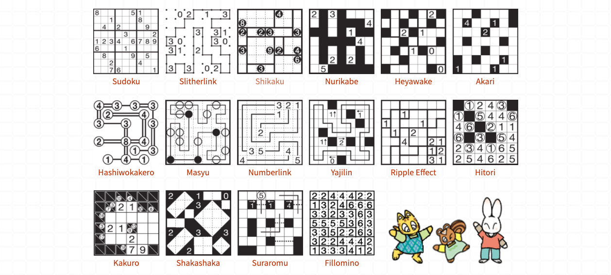
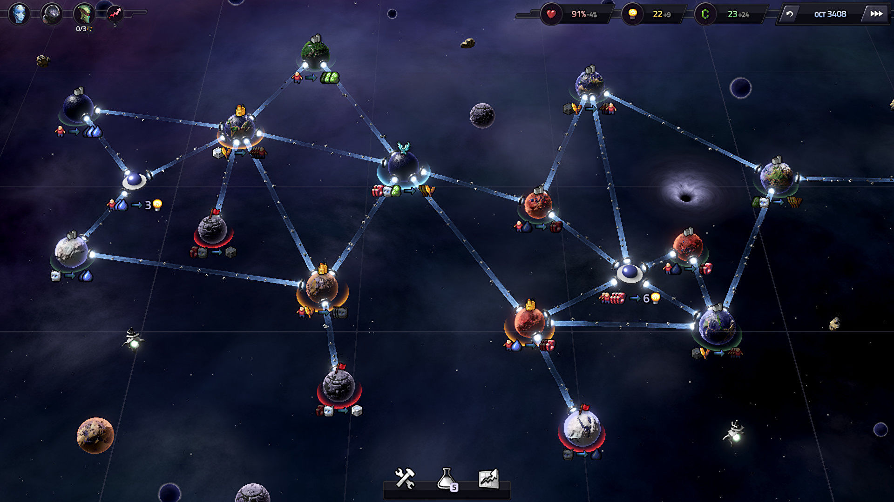
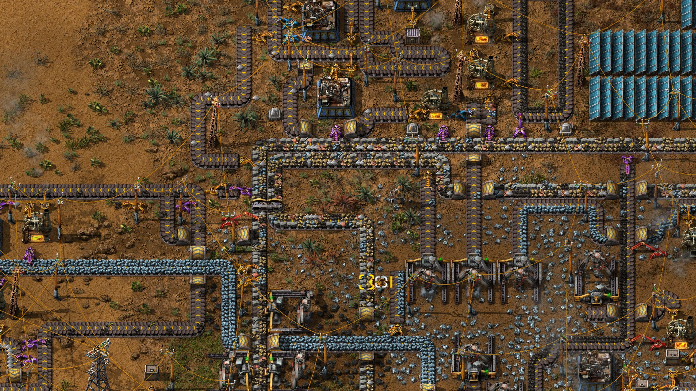
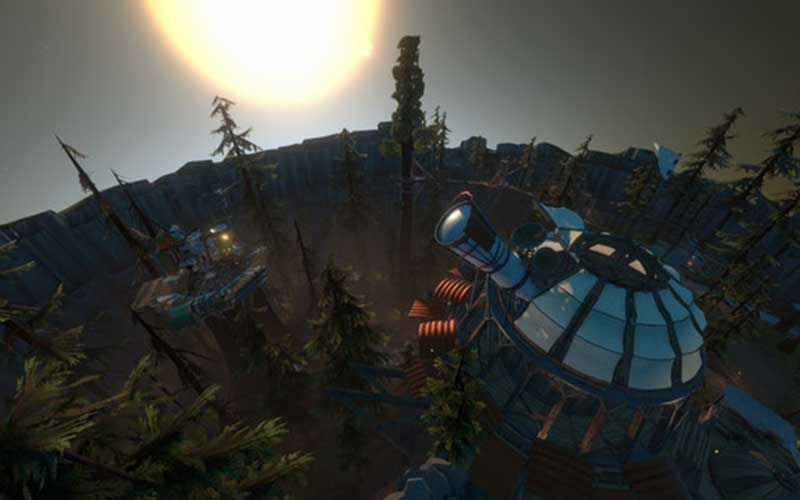
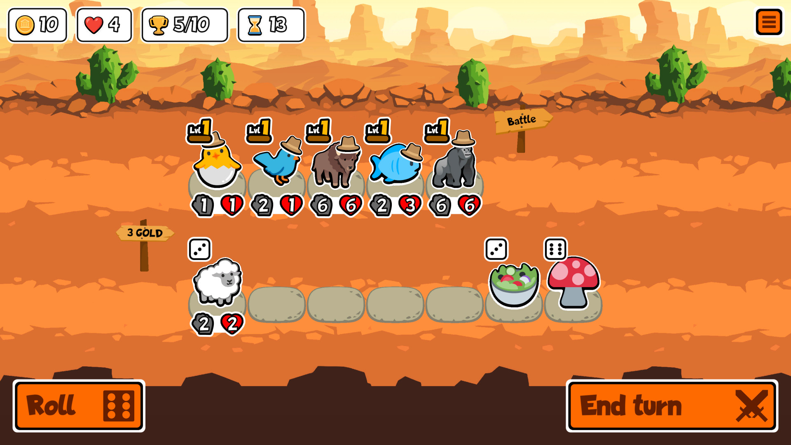
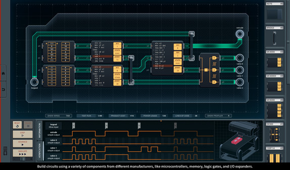

Each year I reflect on the games I played in the previous year. Here’s [last year’s reflection](/blog/what-i-played-2020).

This is the first year I’ve tracked all the games I played. You can see them in [this Twitter thread](https://twitter.com/ryrykubes/status/1361463678420221952). Tracking everything seems to have encouraged me to play a lot more. I clocked in at 81 games this year!

This year I decided to give each game on my list one or more “🏆 Awards”. Since I have so many games this year, I ended up with several larger categories too:

- [My Favorite Games](#my-favorite-games)
- [Honorable Mentions](#honorable-mentions)
- [Games I Liked Watching](#games-i-liked-watching)
- [Board Games](#board-games)
- [Good Small Games](#good-small-games)
- [My Backlog](#my-backlog)

## My Favorite Games

These are my favorite games that I played in 2021. I tried to narrow this down to my top 5 games, but I ended up with 7. ¯\\\_(ツ)\_/¯

### Nikoli Logic Puzzles - 🧩 Best Puzzler

[Nikoli](https://www.nikoli.co.jp/en/) is a Japanese company that publishes puzzle magazines. Their puzzles are usually grid based logic puzzles, like Sudoku. But, they've got [many more types](https://www.nikoli.co.jp/en/puzzles/) as well. I picked up a few of their variety puzzle books so I could try them all.

I’ve enjoyed puzzle and logic games for a while now, but primarily played video games. I was looking for something to play in the park to get away from my computer. Doing a puzzle or two every day with my coffee was a great morning routine during the pandemic.

I’ve been drawn to creating and playing video games on grids for a while now (see [Cinco Paus](#cinco-paus-its-still-good) and [Wildfire Swap](https://wildfire.fun)). It’s inspiring to see how many twists Nikoli published puzzles can put on analogue grid-based puzzles. Some use numbers. Some use fully or partially shaded cells. Some use the grid spaces and some use the lines between them. It’s a surprisingly rich play space!

### Slipways - 🔥 Old Fav Genre Revival / ❤️ Inspiring Indie

[Slipways](https://slipways.net/) is a strategy game by [Jakub Wasilewski](https://twitter.com/krajzeg), reminiscent of [Civilization](https://civilization.com/). It eschews interactions with other players in favor of optimizing trade between your own network of planets. It’s fun to explore the galaxy and scheme about how I’ll link various resources together.

I have played something like a thousand hours of Civilization. All of that playtime was back when I had more free time in school. These days, I find even quick speed Civ to be too long. Slipways games clock in for me between one and three hours. This length keeps the game from dragging on and still manages to pack in a ton of fun.

I caught wind of [Slipways Classic](https://krajzeg.itch.io/slipways) while it was a less ambitious [PICO-8](https://www.lexaloffle.com/pico-8.php) game. I learned a lot watching Slipways be prototyped and honed as a smaller game. Watching its transformation into a more complex and visually stunning product was inspirational. I hope to follow a similar path with my own projects.

### Factorio - 🥜 Tough Nut to Crack

I’ve tried [Factorio](https://www.factorio.com/) a few different times in the past and never made it past the tutorial. I’ve enjoyed a lot of similar games, most notably [Mindustry](https://mindustrygame.github.io/). It seemed like Factorio should be a sure fit for me. I’d been meaning to give it one more try and I finally got around to it this year.

In these sorts of games there can be a massive friction point when you unlock new technology. If that unlock demands your previous resources at a scale you didn’t account for, you have to redo _everything_. This time around, I did a little bit of research before I started to see if I could avoid this problem. A lot of Factorio factories use a design called a “Main Bus". This sets your factory up well for expansion.

In the end I played this run of Factorio for around 40 hours and beat the game (launched the rocket). I really enjoyed the optimization and logistic pieces of Factorio. This genre definitely feels like it’s one notch away from just being work that no one pays you for though? I’m not sure! I had fun though!

### Outer Wilds - 👍 Fine, You All Were Right

Everyone I know has tried to get me to play [Outer Wilds](https://www.mobiusdigitalgames.com/outer-wilds.html) since it released. I finally got to check it out and they were right. It's a really interesting game!

The first strong feeling I got while playing wasn't what I expected at all. A splash of cosmic horror. Something about flying through space really freaked me out, perhaps the lack of control and how small you feel? Once I mastered the idea of flying around recklessly through space I started having a good time though! Seeing that transformation in myself is pretty cool in retrospect.

I think Outer Wilds's magic comes from the its zany yet logically consistent worlds. It really does feel like I'm exploring a wild place instead of following a linear narrative. I've enjoyed pieces of this sort of thing in other games, but never seen it as prominently on display as in Outer Wilds.

### Super Auto Pets - 🤖 Best Auto Battler / ❤️ Inspiring Indie

I’ve been following [auto battlers](https://en.wikipedia.org/wiki/Auto_battler) since the original [Dota Autochess mod](https://steamcommunity.com/sharedfiles/filedetails/?id=1613886175) got popular on [Twitch](https://twitch.tv) back in 2019. It’s been pretty interesting to be there for the birth of a new genre and watch it evolve over the subsequent years.

Until this year, I’ve primarily engaged with auto battlers by spectating. They’re usually complicated to play well and require a lot of understanding of the meta. I enjoy watching good players more than playing mediocrely by myself.

[Super Auto Pets](https://teamwood.itch.io/super-auto-pets) is the first auto battler that's gotten me to actually play. This game has a lot of the hard edges of other auto battlers sanded off. The shop and synergies are streamlined. There's no time pressure. And since it’s free to play in browser it was easy to get started.

Any time I see a small budget multiplayer indie game I’m afraid. It seems so challenging to maintain a player base for a small team. Until now, multiplayer auto battlers matched 8 players together for an entire game. This necessitates a large audience to allow players to find consistent matches. It's a BIG ask for a new low budget indie game.

Thankfully, Super Auto Pets takes a brilliant async approach for its multiplayer. They let you complete your turn on your own time. Then, once you lock it in you enter a short matchmaking queue where you're matched against someone else on the same turn. This repeats until you lose all your health or win 10 times. This system also lets players move through the game at their own pace without holding up any one else.

This unique multiplayer is coupled with usage of creative commons emoji for their graphical assets. This adds to Super Auto Pets's character and must help keep costs down. I’m incredibly impressed with this team's resourcefulness and aspire to this level of ingenuity.

### Shenzhen I/O - 💻 Best Programming Game

For a long while, I’ve avoided [Zachtronics](https://www.zachtronics.com/) games. I thought they’d be too much like my day job and be tedious. It turns out, they _are_ like my work except it’s in a magical land where the requirements are well defined and I can finish my tasks in a reasonable amount of time. It’s a dream land!

I got a Computer Engineering degree in school. I did not enjoy worrying about circuits and handling analogue device signals. This is why I ended up as a programmer and not a hardware engineer. For all its faults, code does exactly what you tell it to.

[Shenzhen I/O](https://store.steampowered.com/app/504210/SHENZHEN_IO/) is wonderful because it takes out all the ambiguity of real life electronics. I don’t have to worry if the batteries are at 12% and my code is technically fine, but now my sensor is underpowered and showing a false negative. It takes the fun of low-level programming and makes it reliable.

Turns out, I really enjoy writing code. I just don’t love working. 🙂

## Honorable Mentions

These are some more games that I enjoyed in 2021. I felt like I needed to pick a subset to be “my favorites” above. But I liked all these games so much that I wanted to talk about them too. 🙂

### Trash the Planet - 🛠 Developing a Niche Genre (Narrative Clickers) / ❤️ Inspiring Indie

There’s something captivating (and a bit parasitic) about clicker games, which is how [a lot of them are designed](https://www.siliconsasquatch.com/blog/2016/10/24/clicktastrophe). I find the exposed mechanical bits of their game design intriguing in spite of this.

Not all clickers are hollow. [Universal Paperclips](https://www.decisionproblem.com/paperclips/) is the first I encountered with a message and an ending. It felt really fresh at the time, and showed me you can say something with this genre. [Trash the Planet](https://thisgameishaunted.itch.io/trash-the-planet) by [This Game is Haunted](https://twitter.com/thisgamehaunted) iterates on this “narrative clicker” genre.

Trash the Planet is completable in a few hours, has a solid narrative, and an increasingly relevant anti-capitalist message. I love seeing This Game is Haunted subvert a genre that’s frequently predatory and create something fulfilling instead.

### Bowser's Fury - 😀 Got Me into a Genre I Don’t Play (3D Platformers)

I don’t play a lot of platformers, 3d or otherwise. It's been years since I last played one. There was a lot of hype around [Bowser’s Fury](https://supermario3dworld.nintendo.com/bowsers-fury/) with my friends though, so I decided to give it a try anyway.

I'm glad I did, Bowser's Fury was awesome! I really liked the fairly short play time. It did not overstay its welcome, which is not what I expect out of "AAA" games these days.

This game has great feeling movement variations with Mario's upgrades and Plessie's swimming. I really liked the way the contiguous “open world” encouraged me to explore. Bowser showing up and changing the world state created a fun dynamic experience too, for the most part.

In the end, I decided this didn’t quite make the top cut for me because toward the end of my play time I got frustrated with the Bowser mechanic.

### Understand - 🧩 Best Puzzler Honorable Mention / ❤️ Inspiring Indie

[Understand](https://store.steampowered.com/app/1299400/Understand/) by [Artless Games](https://twitter.com/artless_games) is a cool game inspired by [The Witness's](https://store.steampowered.com/app/210970/The_Witness/) puzzles. You have to work out the rules to each series of puzzles by yourself which leads to a lot of fascinating moments of realization.

This game started out _incredibly_ strong for me. Eventually, as the game got more complex it lost a bit of its shine for me. The first 2 or 3 worlds were truly wonderful though! I suspect I'd even like those more complex worlds after my time away too.

It’s super inspiring to find a game like this on Steam. It has a lot of positive reviews and is focused on gameplay with minimal graphics. It’s very encouraging to me that a game like this can exist, apparently successfully, on Steam. I aspire to make games in similar niches to this one where I focus on gameplay over graphical fidelity.

### Captain Toad: Treasure Tracker - 🐣 Good Puzzler to Play with Non-puzzlers

I like puzzle games, but they don't usually have as broad appeal as other genres. [Captain Toad: Treasure Tracker](https://www.nintendo.com/games/detail/captain-toad-treasure-tracker-switch/) is a fun puzzler that manages to bridge that gap. It’s cute and gives you a lot of satisfaction from exploring each level's intricacies.

Each level is a detailed diorama that you can spin around in 3d. You manipulate the level by sliding parts of it around so Toad can explore and discover secrets. It’s not a complicated game, but it’s a ton of fun. This was a great fit for playing with my partner who isn’t really into puzzle games like me.

### What the Golf? - ⛳️ The Silliest Game

I had a really great couple of evenings with [What the Golf?](https://whatthegolf.com/) on Switch. It subverts a ton of what I've come to expect from other golf games. The game isn’t trivial, but the levels feel designed to keep you moving quickly rather than provide challenge. This is nice at first because you never feel _stuck_ inside of any particular gimmick.

After my first few evenings in love with the game it started to lose its charm though. You can only subvert my expectations so many times (quite a few times, apparently!) before I start to _expect_ the subversion. At first this was okay, because they were still delightful. But with the spell broken I eventually fell off. I wonder if this is partially because it was designed as a mobile game and not meant to be binged like I did.

Still a really fun game! But if it had somehow carried its initial momentum all the way to the end of the game, it would’ve been a top pick for me.

### Cinco Paus - 🙂 It’s Still Good

I picked [Cinco Paus](https://smestorp.itch.io/cinco-paus) as one of my favorite games of last year. It’s a lot of fun, my favorite mobile game, and an inspiring roguelike. I won’t spend a lot of time talking about it here again. I played it for a good chunk of the year though, so I couldn't leave it off this list entirely!

### Dungeon Warfare 2 - 🔥 Runner Up Fav Genre Revival

[Dungeon Warfare 2](https://store.steampowered.com/app/698540/Dungeon_Warfare_2/) is a solid tower defense game. I used to play a lot of these back in the day. They were popular on the flash game sites I frequented, but I've not played many since those days.

Dungeon Warfare 2 is a traditional tower defense game. You unlock traps, place them on a map, and upgrade them. Then, waves of enemies march toward your base and watch your traps decimate them.

The game shines really brightly at various points by layering in a dizzying amount of meta systems. You can unlock different maps and they all have optional challenges that give you XP. And you can equip runes similar to [Hades](https://store.steampowered.com/app/1145360/Hades/) heat system to earn more XP. You can unlock skill points that change how you play. You unlock new traps. You get item drops that buff various properties of your traps. And before you play each map you get to customize almost all of these things into different builds. It's kind of a lot!

When all of these systems worked together and encouraged me to experiment it was _amazing_. For example, I saw a map with pits and equipped my pushing traps, items that buff push strength, and a rune modifier that increased enemy health. Then I’d create a gauntlet that instakilled enemies by pushing them into pits where I didn’t care they had increased health and got sweet bonus XP. It felt very cool!

There were unfortunately a comparable number of moments where I’d look at this huge sea of options and feel like it was mostly useless. I’d equip any old build mush around some items and just start the level. It’s hard to have the highs without the lows, but it does make me wonder if the game would be better off with just a few less systems.

In the end, I still played this game for over 10 hours and had a blast with it! I just wish that I’d been able to really love it. Definitely worth checking out if you like the genre.

### SNKRX - 🤖 Honorable Mention Auto Battler

[SNKRX](https://store.steampowered.com/app/915310/SNKRX/) is a pretty faithful migration of the original Dota Autochess style shopping system. It lets you bank gold, collect interest, and re-roll your shop. You hunt for matching archetypes and triples of your characters to power them up. I’m not a big fan of interest mechanics, but it didn't get in the way here.

The primary innovation of SNKRX is that it's single player. Like with [Super Auto Pets](##super-auto-pets-best-auto-battler-inspiring-indie), removing the need to queue up with 7 other players is huge for making this genre accessible. The other notable feature in SNKRX is that you have some control of your units during the battle phase. You steer your adventuring party around sort of like a snake, hence the game's name.

SNKRX didn’t have legs after I beat it a couple times, which didn't take many attempts. There are a few different builds to check out. But after a few hours they all collapsed into similar feeling runs. Still, this was a great time at the $3 mark!

### Loop Hero - 👽 Weird Genre

[Loop Hero](https://loophero.com/) by [FourQuarters](https://twitter.com/_FQteam) is a sort of auto battlery/idley game that’s hard to pin down exactly. You set up a deck of terrain cards and pick a character class for each run. You place these cards over time as you play and they build a map. Then your character walks around a looping path through the map fighting monsters, leveling up, and picking up RPG item drops.

I picked Loop Hero up at launch and played alongside a lot of streamers. It was a lot of fun figuring out the odd mechanics as part of a larger community. At some point, the game got mostly solved and the magic wore off. I had a really fun week or two exploring a bizarre game as part of a community though.

## Games I liked Watching

I spend a decent amount of time watching other folks play video games. Sometimes it’s because I don't have a system I can play the game on. Sometimes it’s a game I like the idea of but a genre I don’t really like playing myself. Sometimes I’m just “multitasking”. These are some of my favorites that I watched in 2021.

- **[Myth Bearer](https://jc-bailey.itch.io/myth-bearer)** - Myth Bearer is an "Open World Puzzle RPG" by [JC Bailey](https://twitter.com/JC_Bailey1112). I watched [Alex Diener play the game](https://www.youtube.com/watch?v=UmOA4HxsOmU) on YouTube. It's a very impressive indie game, and I purchased the developer's new title [Deep Rune](https://store.steampowered.com/app/1631780/Deep_Rune/) to play myself!

- **[Environmental Station Alpha](https://www.hempuli.com/esa/)** - ESA is a metroidvania by [Hempuli](https://twitter.com/ESAdevlog). This game has a lot of cool secrets and an immersive world. The boss fights were very cool and also way too hard for me so I watched [Smight play this one](https://www.youtube.com/watch?v=oUbQqgslq5M&list=PLVzW5E8pn2COnRfdx87Pla_jKwqCKZo0O&index=1) on Youtube.

- **[Noita](https://noitagame.com/)** - Noita is a roguelike game where every pixel is simulated by [Nolla Games](https://twitter.com/nollagames). [Falling sand](https://boredhumans.com/falling_sand.php) toys have always fascinated me. Seeing a real game built around it is very cool. Noita is also filled to the brim with secrets that blow up your conception of what the game is.

- **[Age of Empires IV](https://www.ageofempires.com/games/age-of-empires-iv/)** - I've loved the Age series since I was little. The [original Age of Empires](https://www.youtube.com/watch?v=ADKHIJ-J4pc) is the [first video game I can remember playing](/blog/most-influential-games#age-of-empires). I don't have a Windows PC to play Age 4 with, but I had a blast watching [Hera](https://www.twitch.tv/hera) and [Day9tv](https://www.twitch.tv/day9tv) learn the game on Twitch.

- **[Babble Royale](https://store.steampowered.com/app/1759440/Babble_Royale/)** - Babble Royale is a battle royale game crossed with Scrabble by [Everybody House Games](https://everybodyhousegames.com/). It's one of those games that sounds totally nonsensical. Then you see it in action and wonder how it took this long for someone to make. It works so well!

## Board Games

I've been spending more time with a smaller circle of friends instead of going to a bunch of community events and meetups. This has given me more time to actually get into a lot more board games than previous years. These are my favorites from 2021.

- **[The Crew](https://boardgamegeek.com/boardgame/284083/crew-quest-planet-nine)** - The Crew is a co-operative [trick taking game](https://en.wikipedia.org/wiki/Trick-taking_game) by Thomas Sing. This was my favorite board game of the year by far! I love a good co-op table top game and The Crew is always fresh because you have 50 mission variants to unlock as you go.

- **[Set](https://boardgamegeek.com/boardgame/1198/set)** - Set is a speed matching game by Marsha J. Falco. It's a simple game to get started with, and has appealed to a wide variety of my friends. This is my go to pick for groups whose gaming tastes I don't know yet.

- **[Hive](https://boardgamegeek.com/boardgame/2655/hive)** - Hive is a 1v1 strategy game that reminds me a little bit of chess. I played a few rounds of this with friends on [Board Game Arena](https://boardgamearena.com/). It's fun to play something chess-like that I don't know too much about.

- **[Just One](https://boardgamegeek.com/boardgame/254640/just-one)** - Just One is a guessing party game by Ludovic Roudy and Bruno Sautter. This is a simple party game that's gone over really well every time we've brought it out. The game also scales well to different sized groups.

## Good Small Games

I played a lot more small games this year. At least, I have memory of playing them since I wrote them down. These are all worth checking out and won’t take up much of your time!

- **[Golf Sunday](https://johanpeitz.itch.io/golf-sunday)** - This is a fun little golfing PICO-8 jaunt by [Johan Peitz](https://twitter.com/johanpeitz). There are a lot of fun details in this game and I'm really impressed with it.

- **[Tiny Islands](https://dr-d-king.itch.io/tiny-islands)** - This is a tile placing game by [David King](https://twitter.com/dr_d_king). It has a great daily shuffle mode that's great for high score chasing with your friends.

- **[Dice Kingdom](https://zwodahs.itch.io/dice-kingdom)** - I playtested an early version of this strategy game by [ZwodahS](https://twitter.com/ZwodahS). It’s great! It expands on the worker placement aspects of [Dicey Dungeons](https://store.steampowered.com/app/861540/Dicey_Dungeons/) that I really liked in a cool way.

- **[Mech Force Inferno](https://tytydavis.itch.io/mech-force-inferno)** - This is a cool game jam entry about robots fighting forest fires by [Tyler R. Davis](https://twitter.com/tylerrdavis). It's super cool to see a game take turn based firefighting in a similar but totally different direction than [Wildfire Swap](http://wildfire.fun/).

- **[King Pins](https://store.steampowered.com/app/1459870/King_Pins/)** - A slick little RTS by [Sokpop](https://sokpop.co/). I played this while being unable to play AOE 4 myself and it provided me with a great evening of entertainment.

- **[Tiny Golf Puzzles](https://beepyeah.itch.io/tiny-golf-puzzles)** - This is a nice small collection of Sokoban-esque puzzles by [Tom Brinton](https://twitter.com/brintown). I don’t often care for this genre, but these were excellent.

- **[Pigments](https://benjamin-soul.itch.io/pigments)** - This is an arcade game entry to the [Disc Room game jam](https://itch.io/jam/disc-room-game-jam) by [Benjamin Soule](https://twitter.com/benjamin_soule_). It has a weird pseudo-turn based mechanic that I found to be pretty interesting. The simple meta structure added to this game adds a lot too.

- **[Mimic](https://sourencho.itch.io/mimic)** - This is little puzzler by [Sourencho](https://twitter.com/sourencho) about copying the moves animals are making in order to become them. The game explores a lot of the interesting ramifications of these mechanics. Mimic focuses on being interesting instead of difficult in this exploration which I very much appreciated.

- **[Wordle](https://www.powerlanguage.co.uk/wordle/)** - The most popular word game on the Internet over the 2021-2022 winter holiday season! It was created by [Josh Wardle](https://twitter.com/powerlanguish) and it’s a lot of fun. I’m still playing it daily!

## My Backlog

Even though I played more games than ever, I still wound up with a big backlog. These are some of the games I wanted to play in 2021. Hopefully I get to them in 2022. :-)

<CloudList>

- [Hitman 3](https://hitman.com/global/)
- [Mario + Rabids Kingdom Battle](https://www.nintendo.com/games/detail/mario-plus-rabbids-kingdom-battle-switch/)
- [Slime Rancher](http://slimerancher.com/)
- [TIS 100](https://www.zachtronics.com/tis-100/)
- [Infinifactory](https://www.zachtronics.com/infinifactory/)
- [868 Hack](https://store.steampowered.com/app/274700/868HACK/)
- [Stellaris](https://www.stellaris.com/)
- [Slipways - Second update](https://slipways.net/)
- [Soko Loco Deluxe](https://store.steampowered.com/app/1003730/Soko_Loco_Deluxe/)
- [Unpacking](https://www.unpackinggame.com/)
- [The Wild at Heart](https://www.moonlightkids.co/the-wild-at-heart)
- [Inscryption](https://www.inscryption.com/)
- [Untitled Goose Game](https://goose.game/)
- [T-Minus 30](https://store.steampowered.com/app/1371750/TMinus_30/)
- [The Wratch's Den](https://punkcake.itch.io/wratchs-den)
- [Jupiter Hell](https://store.steampowered.com/app/811320/Jupiter_Hell/)
- [One Step from Eden](https://www.onestepfromeden.com/)
- [LEGO Builder's Journey](https://store.steampowered.com/app/1544360/LEGO_Builders_Journey/)
- [Deep Rune](https://store.steampowered.com/app/1631780/Deep_Rune/)
- [Fights in Tight Spaces](https://www.fightsintightspaces.com/)
- [The Crew: Mission Deep Sea](https://boardgamegeek.com/boardgame/324856/crew-mission-deep-sea)

</CloudList>
