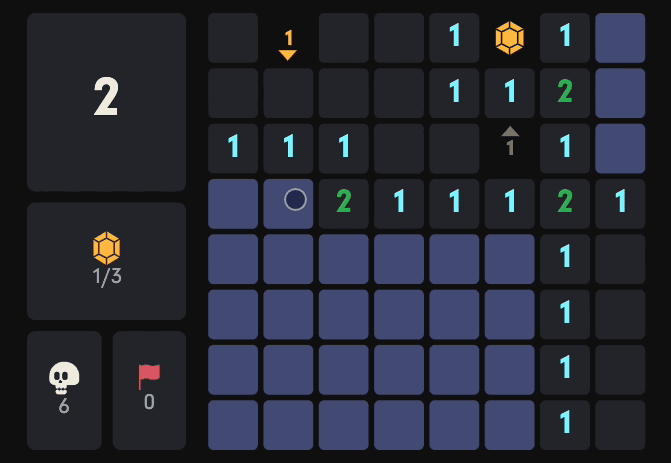
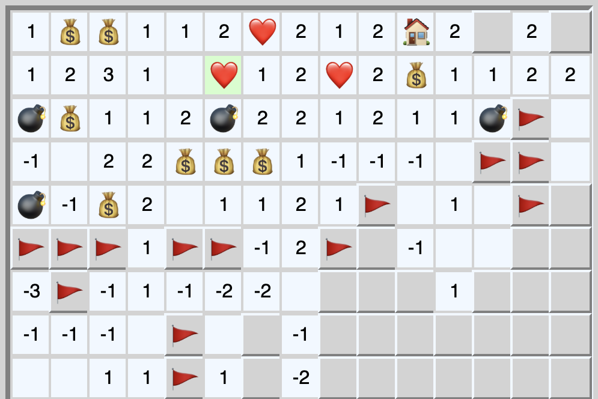
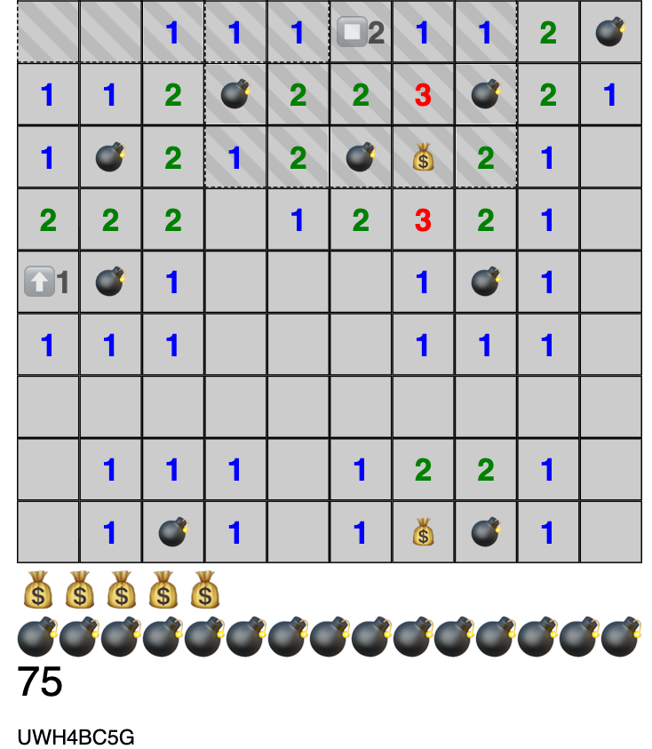

Unearth a cache of buried gems, using logic and clues as your map. The catch: Hidden skulls lurk, too, threatening to thwart your plan. It’s a riff on that classic 1990s logic game, but with a Puzzle Society twist.

💎 [Play Caved on The Puzzle Society](https://www.puzzlesociety.com/logic-puzzles/caved)

 

## Background

Caved is a part time paid contract project I did for [The Puzzle Society](https://www.puzzlesociety.com/), a puzzle game site owned by [Andrews McMeel Universal](https://www.andrewsmcmeel.com/).

Caved is an iteration on a Minesweeper jam game I designed called [Bombfinder RL](https://rmkubik.itch.io/bombfinder). The Puzzle Society needed a more intuitive version of the game with improved UX targeted at a daily puzzle format.

**Original Bombfinder RL screenshot**

This required a series of prototypes and design revisions in partnership with The Puzzle Society producers. I also created a level generator puzzle creators could use to seed hundreds of puzzles.

Caved was built with TypeScript, React, and Mobx.

**Early caved prototype**

This version of Caved contained multiple kinds of clues. The generator exposes ways for puzzle creators to tune their placement.

