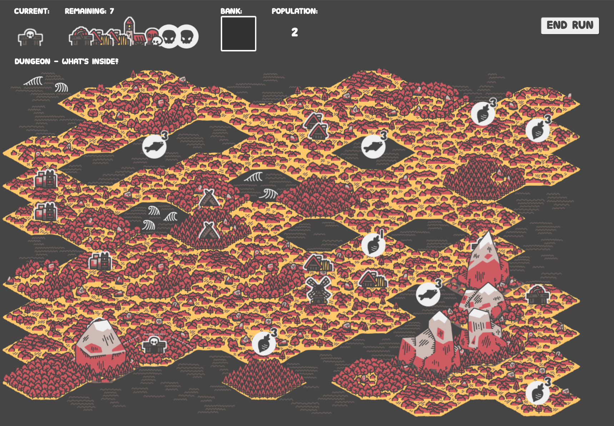

## Welcome to the Island

Build a thriving colony one building at a time. Click to place buildings in the right locations will generate new ones. Keep placing buildings until you run out. Your goal is to reach the highest population possible on your island.

<NoSsrIslandMakerEmbed />

## About

Island Maker was created during the month of February 2022 as part of Ryan's [1GAM](https://onegameamonth.com/). This game was also an entry to the [Eggplant Community Jam](https://itch.io/jam/hexes-eggplant-podcast-community-game-jam-12) where the theme was "Fun with Hexes". The excellent games [Tiny Islands](https://dr-d-king.itch.io/tiny-islands) and [Carcassonne](https://boardgamegeek.com/boardgame/822/carcassonne) inspired Island Maker's mechanics.

🏝 [Chat about Island Maker in Discord!](https://discord.gg/VMymDhn)

## Credits

**Dev:** [Ryan Kubik](https://ryankubik.com/)

**Art:** [Steven Colling](https://www.stevencolling.com/)

**Playtesting:** Brendan McCracken, Mickey Sanchez, Eggplant Show community

**Additional Design By:** AlternaSports Ltd.
