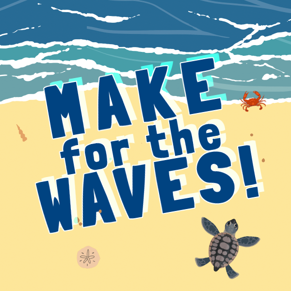

Make for the Waves is a game about baby turtles breaking out of their shells.

You hatch on a tropical beach and then race to the ocean as fast as you can with your siblings. The first one to hit the waves gets the crown! How long can you keep hold of it?

This game was built using an online video game console called Air Console. You and your friends use your smartphones to as gamepads to play fun local multiplayer games together right in your browser.

 

📱 [Play Make for the Waves on your smartphone now!](https://www.airconsole.com/play/sport-games/make-for-the-waves)

 

<iframe
  width="560"
  height="315"
  src="https://www.youtube.com/embed/Wi6lp_84M1k"
  frameBorder="0"
  allow="accelerometer; autoplay; clipboard-write; encrypted-media; gyroscope; picture-in-picture"
  allowFullScreen
></iframe>
