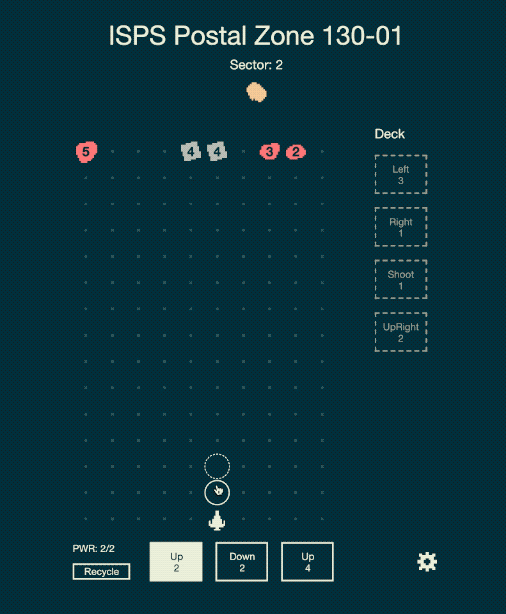
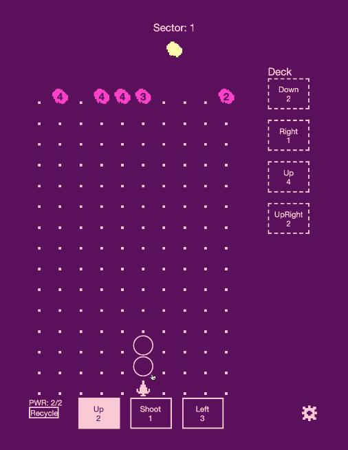

Rocket Jockey is a turn based dodge 'em up where you try to race to the edge of the galaxy without getting smashed by an asteroid.

This game was originally created as an entry to the JS13k game jam in 2021. I worked with my friend, Brendan, on this project and we decided to expand the original prototype after the jam. The GIFs below show some of the updates we've made to the game since the original.

 
This is one of our first experiments with non-asteroid enemies/entities for you to
encounter as you fly.

 
We added the ability to create color themes. These are some wacky ones we made for
Halloween.

 
The Weaver is the second ship we added to Rocket Jockey. Right now, it has a different
set of movement cards that cause you to bounce in and out of danger a lot more than
the default ship. We have some plans for new cards and abilities too.
