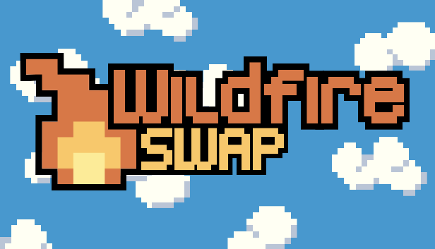
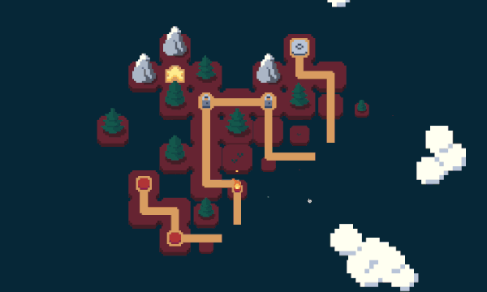

Swap tiles, fight fires! Consider your moves carefully: fire spreads fast, and an out-of-control fire is unstoppable.

- **Explore** 120+ handcrafted levels.
- **Discover** deep interactions within apparently simple mechanics.
- **Journey** through different environments providing new challenges and strategies.
- **Challenge** yourself with B-side worlds full of new mechanics and harder puzzles.

Wildfire Swap is a game about exploring the efforts to control those massive fires. It explores how a small spark can quickly turn into a raging inferno and how easily forces of nature can spiral out of our control.

You take on the role of a wildland fire fighter. Your goal is to create firebreaks between out of control fires and people’s homes by solving tile swapping puzzles. Like wildfires in the real world, you’re at the mercy of the flames. You cannot extinguish them — you must do your best to contain them.

Every time you make a move to contain the fire, it spreads more out of control. Through well-planned and calculated movements you can prevent the flames from burning down homes. Each level challenges you to understand more deeply how fires spread so that you can adapt your fire prevention strategies.

We hope that people have fun playing Wildfire Swap. And we hope that as they overcome the puzzles in this game, they get some sense of the enormous amount of planning and hard work fire fighting teams put in to contain these fires.

 

<iframe
  style={{
    margin: "2rem 0",
  }}
  src="https://store.steampowered.com/widget/1216030/"
  frameBorder="0"
  width="646"
  height="190"
></iframe>

 

