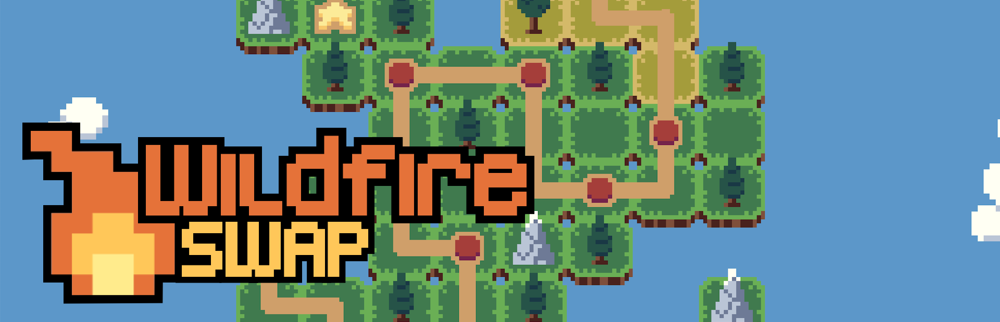
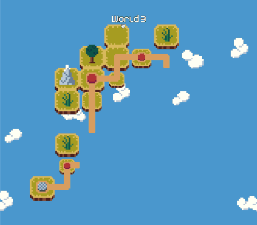

Protect people's homes from raging forest fires by tile-swapping your way out of tricky puzzles in Wildfire Swap.

- **Swap** tiles to change the course of burning fires
- **Solve** a series of increasingly interesting puzzles
- **Challenge** yourself with optional, more complex puzzles
- **Discover** surprisingly deep interactions between many different tile types
- **Enjoy** a simple pixel art aesthetic

Wildfire Swap is a puzzle game where you're presented with a grid of houses, trees, and fires. Each turn you're allowed to swap two adjacent tiles with eachother to try and move the houses to a safe position.

However, every time you make a swap, all of the fires on the map spread to nearby flammable tiles. Your goal is to create a fire break of cleared land between all the houses in a level and the surrounding flames.

 

🔥 🔥 🔥 [Wishlist Wildfire Swap on Steam!](https://store.steampowered.com/app/1216030/Wildfire_Swap/) 🔥 🔥 🔥

 

